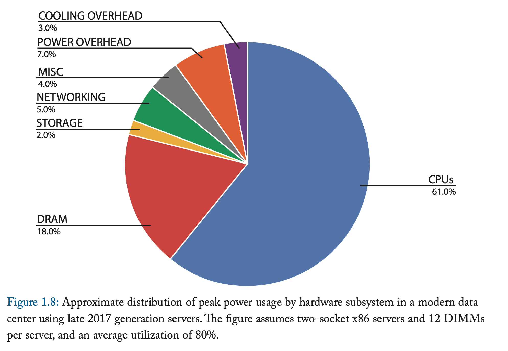
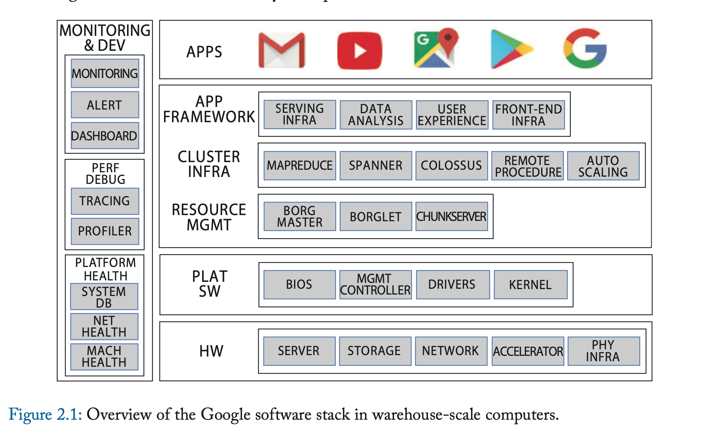
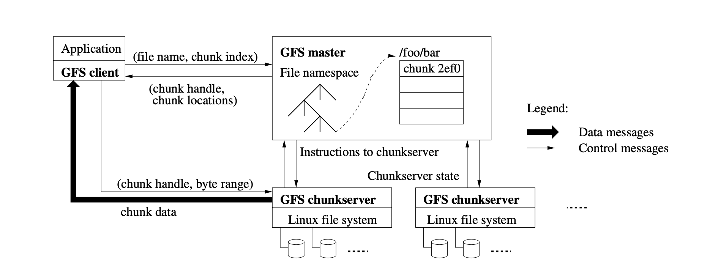
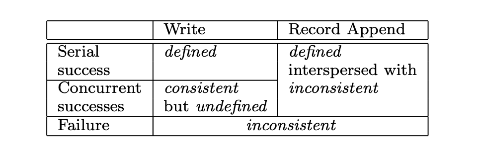
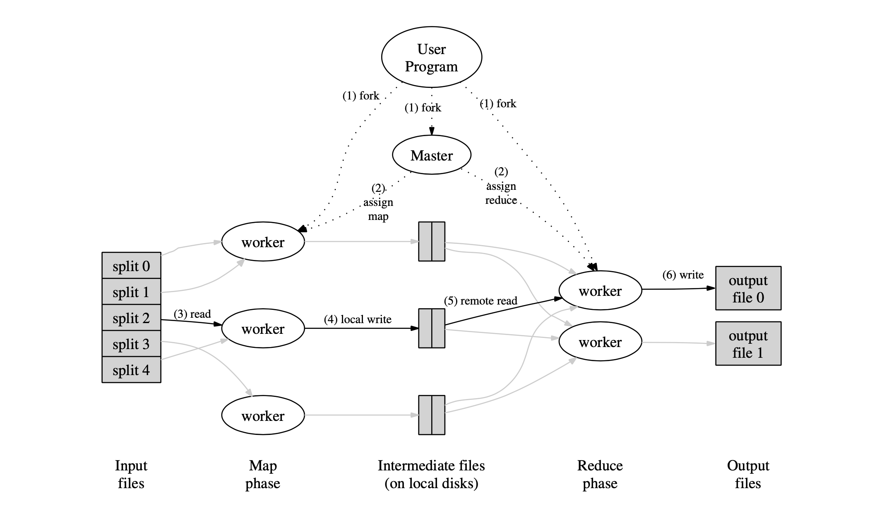

|Title | Author|
|---- | ----|
|"Introduction and Overview"| Rahul Vadaga <srv304@nyu.edu>|

# Introduction
The readings covered in this week include:

1. **Datacenters** - Introduction to Warehouse-Scale Computers (WSCs), plus an overview of different software layers in a WSC deployment. WSCs are datacenters that power large scale web services offered by companies such as Google, Amazon, Microsoft, Baidu, etc.
2. **Google File System (GFS)** - Distributed file system for supporting large scale data-intensive applications.
3. **MapReduce** - A programming model based on map and reduce operations. Automates parallelization, data partitioning and distribution.

Although these papers discuss ideas/problems around large scale web services, they are addressing different problems. So it makes more sense to split them into 3 parts and study them separately.

# Part 1 -  Datacenters
## Motivation
Over the past few years, computing and storage have moved from desktop PCs
to smaller devices such as mobiles, tablets combined with large scale web
services. Traditional enterprise workloads are increasingly shifting towards
cloud computing. This offers several advantages -- low cost per user, faster
application deployments, ease of management, higher compute capability, etc. This
trend has created a new class of computing systems called Warehouse Scale
Computers (WSCs) -- so named to signify the massive scale of their software
infrastructure, data repositories, and hardware platform.

In WSCs, a typical program consists of many individual programs interacting
to implement complex services such as Search, Email, Maps, etc. The hardware for
such a platform would consist of 1000s of compute nodes with their corresponding
NICs and storage devices, power distribution and air conditioning equipment, and
extensive cooling systems. Managing and utilizing these resources effectively,
deploying applications, ensuring high availability (close to 100% uptime), and
monitoring the system health are all important aspects that need to be
considered in designing the software stack for a WSC system.

## Approaches
The reading gives an architectural overview of WSCs in Chapter 1 and an overview of the software stack in Chapter 2.

### Hardware Overview
#### 1. Compute
The building blocks for WSCs are their compute servers, typically low-end,
mounted in a 1U or a blade enclosure. 10s of servers are grouped together
within a rack, and use a local Ethernet switch to communicate with each other.
These rack-level switches are also connected to cluster-level
(datacenter level) switches. Multiple processing blades can also be connected to
networking blades through an I/O bus such as PCIe.

More recently, compute hardware such as GPUs and custom accelerators are also
being added to servers. These are usually connected through custom or
industry-standard interconnects.

#### 2. Storage
Disks and flash storage devices (SSDs) are used to build a WSC storage system.
These devices are connected to the datacenter network and are managed by complex
distributed systems.

There are 2 ways of building a storage systems - Directly Attached Storage (DAS)
and Network Attached Storage (NAS). In a DAS, storage
units are directly connected to compute servers, whereas in NAS, they are all
aggregated in storage servers, which compute servers connect to to access files
over the datacenter network. WSCs designers should balance key metrics while building a storage system -- bandwidth, IOPS, capacity, tail latency and TCO.

Distributed storage systems such as Google File System (GFS), Amazon Dynamo
provide APIs for application developers, while accounting for scalability,
consistency and fault-tolerance.

#### 3. Networking
Designing the networking fabric involves a trade-off between speed, scale, and cost. A typical switch consists of 48 ports to interconnect servers operating between 40-100 Gbps within a rack. Bandwidth within a rack of servers tends to be homogenous. Switches that are tied to cluster-level switches tend to be more expensive. Because of this cost discontinuity, networking devices are organized in a 2 level hierarchy - commodity rack-level switches (for intra- and inter-rack communication) and cluster-level switches (inter-rack communication). In such cases, programmers must take into consideration the relatively scarce cluster-level BW and exploit rack-level networking locality.

Another option to avoid the cluster-level bottleneck would be to invest in an interconnect fabric such as Infiniband. Infiniband usually scales to a few 1000 ports, but this is an expensive solution in comparison.

In addition to 2-tier Data Center Networks (DCNs), 3-tier networks also exist and consists of these layers -- access layer (servers are connected at this layer), distribution layer (called the "smart layer"; routing, filtering and QoS policies are managed here) and core layer (most powerful; moves packets between distribution layer devices).

Popular datacenter topologies include Fat-Tree, Leaf-Spine, Vl2, JellyFish, DCell, etc. For an overview of these topologies, see [this paper](https://arxiv.org/pdf/1712.03530.pdf).

#### 4. Buildings and Infrastructure
In addition to the 3 components discussed above, WSCs require other components related to power delivery, cooling systems and building infrastructure. Building design decisions can dramatically influence availability and uptime of the WSC.

WSCs rely on sophisticated power delivery designs. They have significantly high power requirements -- on the scale of 100s of MWs -- which is more than what 1000s of individual households would need. They also require backup and redundancy mechanisms built into them -- such as UPSs, generators and backup batteries -- at different levels to ensure 100% uptime.

#### 5. Power Usage

In modern IT equipment, CPUs consume most energy, followed by DRAM (memory). There has been a shift in trend over the past few years, owing to factors such as - (1) CPUs are now able to run closer to their maximum power envelope, (2) memory has shifted from FBDIMMS to DDR3/DDR4 systems that have better energy management, (3) Today's systems have a higher ratio of CPU performance per GB of DRAM, etc.

### Software Overview

The applications that run on WSCs dominate many system design trade-off decisions. A WSC software stack is organized in multiple levels based on their functionality:

#### 1. Platform Level
Common firmware, kernel, OS distribution and libraries expected to be present in all the servers. This provides a basic machine abstraction layer on top of which all the other layers are built on.

#### 2. Cluster Level
Just like how an OS manages resources and provides services in a single computer, in a WSC system, which consists of 1000s of computers, networking and storage systems, the cluster level software provides analogous functionality to support the larger scale. This layer can be categorized into 3 software groups:

a. **Resource Management:** Controls mapping of user tasks to hardware resources, enforces priority and quotas, and provides basic task management services. An advanced scheduler would allow users to specify their job requirements at a higher granularity - CPU performance, memory capacity and networking bandwidth, etc. Examples include Kubernetes and Borg.

b. **Cluster Infrastructure:** Large scale web services rely on components such as distributed storage, remote procedure calls (RPCs), message passing and cluster-level synchronization. It's important to provide this functionality with high performance and high availability. Examples of cluster infrastructure software include Colossus, Dynamo and Chubby (these are reliable storage and lock services).

c. **Application Framework:** The layers described above are meant to simplify building large scale applications for programmers. In addition to managing resources and relying on distributed components for storage, building frameworks that simplify development of new products can prove beneficial. Common higher level operations such as data partitioning, distribution and fault tolerance can be packed together. Examples include Flume, MapReduce, Spanner and BigTable.

#### 3. Application Level
This layer is software that implements a specific service: Maps, Gmail, Video-on-demand services like YouTube, etc. There are a wide range of web-based services, and this means that WSCs need to support a diversity of application-level requirements. For example, a web-search service may not need high performance atomic updates, and can forgive hardware failures. However, an application that tracks ad clicks can't compromise here - because it's a financial service. This requires the datacenter to be a general purpose computing system - since this means developers need not have specialized skills. However, for some workloads such as video conversion/serving, machine learning applications, having specialized hardware is necessary to meet a service's latency requirements.

#### 4. Monitoring and Development Software
Given the size and complexity of workloads and hardware infrastructure, monitoring
framework is an essential part of a web service. This would allow operators to
ensure the service is meeting latency and throughput requirements, and to also
quickly diagnose system failures and take corrective actions during disruptive
events.

## Trade-Offs
1. DAS vs NAS: DAS can reduce hardware costs and improve network utilization, but NAS approach tends to simplify development and provides higher QoS.
2. Strong consistency vs weak consistency in storage: Google's BigTable and Amazon's Dynamo provide database-like functionality with weaker consistency models. Newer storage systems such as Spanner provide strong consistency.

# Part 2 - Google File System (GFS)
## Motivation
GFS is a scalable distributed file system for supporting large distributed data-intensive applications. It shares the same goals as previous distributed file systems such as performance, scalability, reliability and availability, but its design is primarily driven by Google's workload -- supporting its search service. Some assumptions in its design include:
1. **Component failures** are considered a norm rather than the exception.
2. The file system needs to **handle huge multi-GB files efficiently**. Dataset sizes are in the scale of TBs and are fast growing.
3. Workloads consist of (1) **large streaming reads**, and (2) **small random reads**.
4. Most files are **updated by appending new data** rather than overwriting existing data. While random writes are uncommon, it should be able to handle **many large, sequential writes**.
5. Multiple clients can **concurrently append to the same file**.
6. **High sustained bandwidth** is more important than low latency.

## Approaches
### Interface
GFS supports typical file system operations: *create*, *delete*, *open*, *close*, *read* and *write*. In addition, GFS also allows *snapshot* (to create a copy of file/directory tree at low cost) and *record append* (to allow multiple concurrent appends to a file).

### Overview of GFS Architecture

A GFS cluster consists of a single master and multiple chunkservers. At any given time, multiple clients can access the file system.

Files are divided into fixed size chunks (64 MB each), and each chunk is identified by its chunk handle. For reliability, each chunk is replicated on 3 chunkservers. Users can also specify different replication levels for different regions of the file namespace.

Master maintains all file system metadata -- namespace, access control information, mappings from files to chunks, and locations of chunks. Its other functions include chunk lease management, garbage collection, and chunk migration between chunkservers. Master periodically communicates with each chunkserver via *HeartBeat* messages.

Importantly, clients communicate with master to fetch metadata but they access
data from the chunkservers, so as to reduce communication bottleneck at the master. Neither the clients nor the chunkserver cache file data.

A simple read operation: When a client wants to read a file, they place a request to the master by providing a filename and chunk index, and receive the chunk handle and locations of the replicas from the master. Master also includes information for chunks following those requested, to keep client-master communication minimal. Client then communicates with closest replica (i.e. chunkserver) to access the data.

### Metadata
**In-memory Data Structures:** All the metadata is stored in master's memory. Additionally, file and chunk namespaces, file-to-chunk mappings are kept persistent on the master by logging mutations (called the *operation log*) to its hard disk. This allows recovery in the event of a master crash.

**Chunk Locations:** Chunk location is however not stored persistently -- master polls chunkservers for this information at startup, or whenever a chunkserver joins the cluster. It further keeps this information up-to-date through periodic *HeartBeat* messages.

**Operation Log:** The operational log contains a historical record of metadata changes. Besides it being a persistent record, it also defines the serialized order of concurrent operations. This is a critical piece and changes shouldn't be visible to clients until they become persistent.

Operation log is also replicated on multiple remote machines for further reliability. To keep startup time minimal, log must be small. This is done by check-pointing the file system state whenever log grows beyond a certain size. During recovery, it can load the latest checkpoint from local disk and replay limited number of log records after that.

### Consistency
GFS has a relaxed consistency model to simplify the file system without imposing a burden on the applications. Some definitions:

**Consistency:** All clients see same data regardless of which replica they read from.

**Defined:** Consistent, but clients will also see the mutation in its entirety.

Guarantees by GFS include:

1. File namespace mutations are atomic. Namespace locking at master guarantees atomicity and correctness.
2. The file system state (consistent or inconsistent) depends on data mutation (record append vs write), operation success (success vs failure) and concurrency (serial vs concurrent). [See table above]
3. After a sequence of successful mutations, mutated file region is guaranteed to be defined and contains the data from last mutations. Mutations are applied in the same order on all replicas.

Concurrent successful mutations can leave the region undefined but consistent, meaning all clients see the same data when they read the region, but it may not reflect what any one mutation has written.

### System interactions

Let's consider the scenario where the client wants to do a mutation (write/append). Each mutation is applied to all the chunk's replicas.

1. To maintain consistency, master **grants a chunk lease** to the **primary replica**. All the other replicas are called **secondary replicas**. It also increases the **chunk version number**. It notifies all replicas to do the same.
2. Master gives the client the **primary replica identity**, along with **secondary replicas' locations**.
3. Client **pushes data to all replicas** (in whatever order - need not be primary first).
4. After all replicas acknowledge the data that was sent, **client sends the primary a write request**. Primary assigns a serial number to the mutation and applies it to its local state.
5. **Primary forwards to secondary replicas.** Each secondary applies mutation according to the same serial number.
6. Once the mutation is applied, **secondaries indicate to the primary.**
7. **Primary replies** to the client.

Multiple scenarios are possible. Write was successful in which case that is reported to the client. Write failed at the primary, or at one of the secondaries. If it failed at secondary, client can retry again. If it had failed at primary, step 5 wouldn't have happened.

Some notes:
1. A 64 MB chunk size is advantageous in some ways: client is likely to perform many operations on a given chunk, so keeping a persistent TCP connection can reduce network overhead. But it also has its negatives -- can lead to wasted space because of internal fragmentation.
2. Data flow and control flow are decoupled -- which is a very important design aspect.
2. The chunkserver has the final word over what chunks it does or does not have on its own disks (not the master).

Useful links:
1. [GFS paper authors' presentation at SOSP 2003, Ghemawat et al.](https://www2.cs.duke.edu/courses/spring08/cps214/lectures/lecture15.pdf)
2. [The Google File System, Firas Abuzaid](https://cs.stanford.edu/~matei/courses/2015/6.S897/slides/gfs.pdf).
3. [GFS lecture slides from Cornell, Michael Siegenthaler](http://www.cs.cornell.edu/courses/cs6464/2009sp/lectures/15-gfs.pdf)

## Trade-Offs
1. GFS is tailored to Google's needs. It can also be used in other use-cases where typical operations include large streaming reads, concurrent file appends. But it may not be suitable when there are a lot of random writes to the same file.
2. Having a large chunk size ~64MB can lead to wasted space due to internal fragmentation.
3. GFS has a relaxed weaker consistency model. This may not be ideal for situations where consistency is critical.

## Open Questions and Future Work
The last version of Google File System codenamed Colossus [[link1]](https://www.systutorials.com/colossus-successor-to-google-file-system-gfs/) [[link2]](https://cloud.google.com/files/storage_architecture_and_challenges.pdf) was released in 2010.

# Part 3 - MapReduce
## Motivation
Computations in datacenters can involve processing large amount of
raw data to compute derived data. For example, a search service may
need to process billions of web requests logs to generate a set of
most frequent queries in a given day. This computation needs to be
distributed on several 100s/1000s of machines to finish in a
reasonable amount of time. Many subproblems also need to be solved
-- how to parallelize the computation, how to distribute the data,
and handling node failures. MapReduce is an abstraction that allows
expressing these computations easily, but hides these messy details
of parallelization, fault-tolerance and data distribution.

In this programming model, computations can be expressed as a map
and a reduce operation:

**Map:** Given an key-value pair, this operation generates a set off
intermediate key-value pairs.

**Reduce:** Given an intermediate key and its set of values, the
reduce operation merges these values to form a smaller set of
values (usually zero or one output value).

Let's consider the above example of counting URL Access Frequency again. This can be expressed as a MapReduce computation: The *map* function process logs of web page requests and output the kv pair <URL, 1>. The *reduce* function adds together all values for the same URL and emits a <URL, total count> pair.

## Approaches
MapReduce provides a simple and powerful interface that enables automatic parallelization and distribution of large-scale computations while achieving high performance on large cluster of compute servers.

Many different implementations of MapReduce are possible. The implementation described here is (or was) widely used at Google.

### Execution Overview

*Map* invocations are distributed across multiple machines/workers by automatically partitioning the input data into M splits. Input splits are then processed parallelly by the workers.

*Reduce* calls are distributed by partitioning the intermediate key space into R pieces using a partitioning function (e.g., `hash(key) mod R`). Number of partitions (R) and partitioning function are specified by the user.

During a call to MapReduce function, following actions occur:

1. MapReduce library first splits input files into M pieces of 10-64 MB per piece (this parameter can be controlled by the user). Copies of the user program are started on a cluster of workers.

2. One of the copies is designated as the master. The master assigns work to idle workers -- M map tasks and R reduce tasks are assigned one each per worker.

3. Workers that were assigned map tasks read their corresponding input data splits. It parses kv pairs from the input data and passes each pair to the map function. Intermediate kv pairs generated are buffered in memory.

4. These buffered kv pairs are periodically written to local disk and partitioned into R regions by partitioning function. The locations of these intermediate pairs are sent to the master, which then forwards these locations to the reduce workers.

5. When a reduce worker is notified, it makes RPC calls to access the intermediate kv pairs from map workers' local disks. After reading all the data, it sorts the data by the keys and groups all pairs with the same key together.

6. The reduce workers iterates over this data and calls the reduce function on each key. It writes the output to a file for its partition.

7. After all map and reduce tasks are completed, the master notifies the user program.

The output of the execution is available in R output files. Generally, these files need not be conflated and can be directly passed on to the next MapReduce call.

### Master Data Structures
For each of these M+R tasks, the master stores the state (*idle*, *in-progress* or *completed*) as well the identities of the workers. If any worker finishes its task, the master resets its state to *idle* and the worker becomes re-eligible for scheduling.

The master is responsible for handing over map tasks output to reduce workers. So it also stores the location and sizes of the R file regions.

### Fault Tolerance

**Worker Failures:** MapReduce tolerates worker failures gracefully. The master monitors the worker by pinging it periodically. If no response is received within a set timeout period, it assumes the worker is down and updates its internal state for the worker to *failed*. Completed map tasks need to be re-executed on failure because the task output is located on the failed machine's local disk, and hence is inaccessible. However, completed reduce tasks need not be re-executed because they save their outputs to a global file system.

**Master Failure:** The master writes periodic checkpoints of the master data structures above. After a crash, it can load from the last checkpointed state.

**Semantics in Presence of Failures:** MapReduce makes the following guarantee --
when the map and reduce functions in the user program are deterministic
functions of their input values, then MapReduce produces the same output as would
have been produced by a non-faulting sequential execution of the entire program.
This is achieved through atomic commits of map and reduce task outputs.

### Locality

MapReduce reads its input from and writes its output to GFS. Network bandwidth
is conserved by taking advantage of the fact that input data is stored on local
disks of machines within the cluster. The master takes into account location
information of input files in the GFS replicas, and tries to run the map task on
the same machine. If that fails, it tries to run on the machine closest to the
replica of the corresponding input split.

### Backup Tasks

There may be a machine (a "straggler") that takes unusually long time to complete its map or reduce task. This can happen due to a variety of reasons -- bad disk, other pending task on the machine, or it could also be a software bug.

The authors provide a general mechanism to deal with stragglers. When a MapReduce operation is close to completion, the master schedules backup executions of in-progress tasks. When the straggler process (the primary) or the backup execution completes, the master marks the task as completed.

Some notes:
1. The key contributions of MapReduce is not its ability to express computations as map and reduce operations, but achieving scalability and fault-tolerance for a variety of applications. See [the MapReduce Wikipedia article](https://en.wikipedia.org/wiki/MapReduce).
2. [Apache Hadoop](https://hadoop.apache.org/) has a popular [open-source implementation](https://hadoop.apache.org/docs/current/hadoop-mapreduce-client/hadoop-mapreduce-client-core/MapReduceTutorial.html) of MapReduce.

## Trade-Offs
1. A large variety of problems can be expressed as MapReduce computations. MapReduce was used for generation of data for Google's production web search service, for data mining, for machine learning and several other systems.
2. MapReduce is appropriate even when network bandwidth is scarce. As explained above, it exploits GFS design to achieve locality.

## Open Questions and Future Work

1. For data processing tasks, [Apache Spark](https://spark.apache.org/) is mroe
commonly used. This is because of the [difference in processing speed](https://www.scnsoft.com/blog/spark-vs-hadoop-mapreduce) -- MapReduce needs to read from
and write to a disk, whereas Spark can handle data in-memory, making it much
faster.
2. [Google has abandoned MapReduce](https://www.datacenterknowledge.com/archives/2014/06/25/google-dumps-mapreduce-favor-new-hyper-scale-analytics-system) in favour of a new cloud analytics system called [Cloud Dataflow](https://cloud.google.com/dataflow).

