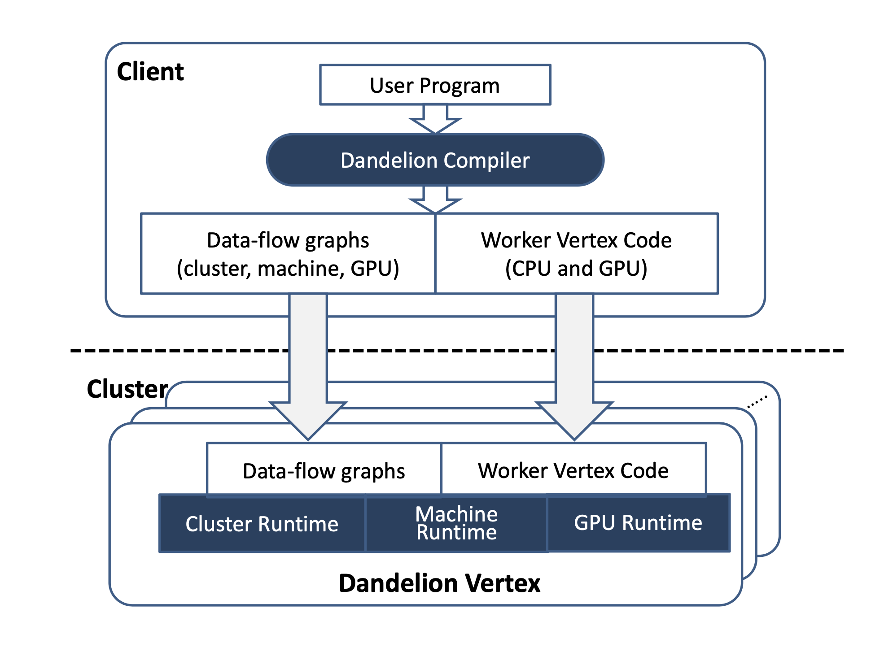
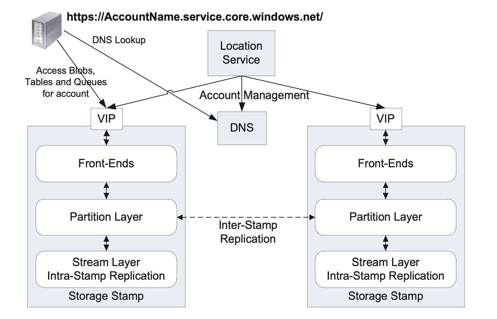
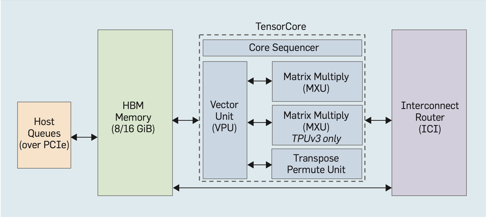

# Dandelion

## Introduction
Dandelion aims to provide a single simple programming interface for running demanding applications on heterogenous clusters containing CPUs, GPUs, FPGAs etc while abstracting away parallelizing and mapping computation. 

## Motivation
Heterogenous systems gain performance or energy efficiency not just by adding the same type of processors, but by adding dissimilar coprocessors, usually incorporating specialized processing capabilities to handle particular tasks. Dandelion is designed for compute clusters where each node is equipped with multi-core CPUs and GPUs. These clusters are an attractive and affordable computing platform for many demanding applications. Thus, Dandelion has to manage multiple execution contexts with very different programming abstractions and runtimes. This includes handling the complexities such as
1. Architectural heterogeneity - Different instruction-sets/OS services/Application binary interface
2. Resource scheduling - Integrating multiple runtimes efficiently to enable high performance for the overall system.
3. Concurrency - Synchronization and consistency 
To keep things simple, it allows the programmer to write sequential code in a high-level programming language such as C#, and the system automatically executes it utilizing all the parallel compute resources available.

## Approach
#### Input
Dandelion takes in the user program written in LINQ (Language Integrated Query) as well as the partitioned data files. LINQ provides relational operators on collections. The operators are integrated seamlessly into high-level .NET programming languages

#### Compiler
Firstly, it generates CUDA code by performing translation on .NET byte-code by mapping C# types to CUDA structs and methods to kernel functions. The main constraint lies in dynamic memory allocation as GPU dont deal with it well. Secondly, it generates three levels of dataflow graphs to orchestrate the execution
1. Cluster Level - optimized for parallel execution on the distributed compute substrate. Decides which machine executes what.
2. Machine Level - describing the execution on that machine and how to manage input/output and execution threads
3. GPU level - generated to describe the computation.



#### Runtime 
Cluster execution engine assigns vertices to available machines and distributes code and graphs, orchestrating the computation. Each node executes its own dataflow graph, managing input/output and execution threads.
1. GPU Dataflow Engine (PTask) - DAG-based dataflow execution engine with constructs that can be composed to express iterative structures and data-dependent control flow; these constructs are required to handle cyclic dataflow and streaming for Dandelion
2. Cluster Dataflow Engine - 
    1. Dryad - Large cluster where fine grained fault tolerance is required. This design, the output of a vertex is written to disk files so transient failures can be recovered by vertex re-execution using its disk inputs.
    2. Moxie - allows the entire computation to stay in memory when the aggregate cluster memory is sufficient. holds intermediate data in memory and can checkpoint them to disk. caches in memory datasets (including intermediate data) that will be used multiple times in a single job.
3. Machine Dataflow Engine - Asynchronous channels are created to transfer data between the CPU and GPU memory spaces
    1. For CPU: parallelize the computation on multi-core
    2. For GPU: dispatch computation to GPU dataflow engine

## Trade-offs
1. Dandelion can improve the performance of computations on the GPU when it knows ahead of time that it is operating on a sequence of fixed-length records. Dandelion depends on low-level GPU run-times such as CUDA. These runtimes have very limited support for device-side dynamic memory allocation, and even when it is supported, the performance can be poor.
2. All the user-defined functions invoked by the LINQ operators must be side-effect free, and Dandelion makes this assumption about user programs without either static or runtime checking.
3. Difficulty of handling variable-length records. To address this problem, Dandelion treats a variable-length record as an opaque byte array, coupled with metadata recording the total size of the record and the offset of each field. However, the over-head of the metadata and additional wrappers functions can cause performance problems. Dandelion resorts to general mapping only when it fails to statically infer the size of the record type.
4. Dandelion is able to improve performance using parallel hard-ware in all cases, the end-to-end speedup can erode sig- nificantly due to I/O. Moreover, the degree to which GPU parallelism is profitable relative to CPU parallelism varies significantly as a function of Dandelion’s ability to hide data marshalling, transfer, and memory management latencies with device-side execution
5. Some tests also show lesser performance on a distributed cluster; which can be attributed to the overhead associated with read from disk files, deserialized to CPU memory, and then transferred to GPU memory.

## Open Questions and Future Work
One apparent disadvantage to this system is the adherence to LINQ. Moreover, the work is promising but incomplete because it is tested on limited number of workflows and accelerators. 

Another limitation of a batch dataflow system is that it requires the input data to be immutable, and all of the subcomputations to be deterministic, so that the system can re-execute subcomputations when machines in the cluster fail.

If one of the major contributors to performance is I/O. Would this benefit from a query planning?


# Windows Azure Storage
## Introduction
Windows Azure Storage enables the ability to store data in the cloud without any size or time limitations while paying for only for what is used and stored. It is responsible for managing the replication and data placement across the disks and load balancing the data and application traffic within the storage cluster.

## Motivation
The key design goals for this paper were:
1. Strong Consistency - Ability to perform conditional read, writes and deletes for optimistic concurrency control (multiple transactions complete without interfering with each other) on strongly consistent data.
2. Scalability / Global and Scalable Namespace - Store and acccess massive(exabyte = 1 billion GB) data from any location. This is allowed by breaking the namespace into three parts and accessing it by ```http(s)://AccountName.<service>1.core.windows.net/PartitionName/ObjectName```. 
    1. Account name - part of DNS host name and is used to locate the primary storage cluster.
    2. Partition name - locate data once the request reaches the cluster.
    3. Object name - identifies individual objects within the partition.
3. High Availability / Disaster Recovery - Achieved by storing data across multiple data centers hundreds of miles apart
4. Multi-tenancy and Cost of Storage - low cost by sharing infrastructure 

## Approach
Three data abstractions - 
1. Blobs (User files)
2. Tables (Structured storage)
3. Queues (Message delivery)

Each blob name is the partition name, whereas the primary key for a table is a combination of object name and partition name. Queue names are partition names and each message is referred by object name.



1. Storage Stamps - Goal is to use around 70% in terms of capacity transactions and bandwidth. Leaving around 20% for short stroking (placing data on outer sectors of the disk for better sek times) and continuing to provide storage capacity if a rack within a  stamp fails.
    1. Stream layer - Append-only distributed file system layer. Each file is replicated three-times across different domains. Re-replicating on failure or checksum mismatch. (Paxos)
    2. Partition Layer - handles transaction semantics, caching and strong consistency for blob, table and queues. Stores and reads objects to/from Stream layer
    3. Front end layer - Stateless servers that authenticate, authorize and route REST requests.
2. Location Services - allocates accounts to storage stamps and manages them across the storage stamps for disaster recovery and load balancing. To provision additional capacity, the LS has the ability to easily add new regions, new locations to a region, or new stamps to a location. 
3. Replication Service
    1. Inter-stamp - Synchronous replication for durability within the stamp across nodes. Focus on objects and their transactions
    2. Intra-stamp - Asynchronous replication across stamps to enable disaster recovery. Focus on Blocks of disk storage
4. Writing - All writes append to the end of a log, which is the last extent. For a request, appends are ordered the same across all replicas of a file and success is returned only if all three are successful. Otherwise, it is sealed and never appended to. Moreover, appended to a new replica set on three other available nodes and these are added to the partitions log.
5. Reading -  Hundreds of billions of blobs across accounts can be stored in a single stamp. It is important to efficiently and scalably enumerate and query them even when traffic patterns are erratic (hot objects/peak loads/traffic bursts). Partition Layer maintains an object index table for each data abstraction and monitors load to each part to determine hot spots. If the load is high, index is split into thousands of range partitions dynamically and load balanced across servers. Data is not moved.

## Trade-offs
1. Append-only System greatly simplify replication and failure however it comes at the expense of extra I/O costs due to the need of Garbage Collector to keep the space usage low. 
2. Scaling the supply of computation cores and storage independently is important in a multi-tenant environment but it increases latency and bandwidth to or from storage.
3. When access patterns cannot be load balanced (e.g., high traffic to a single PartitionName, high sequential access traffic, repetitive sequential scanning, etc.), the system throttles requests of such traffic patterns when they are too high.
4. All the different data abstraction use the same storage stack enabling reusability of several of the systems described above. However, this also makes them not-optimized for specific workloads.

## Open Questions and Future Work
Secondary Read-Only Access for data even if primary is unavailable and to provide another read source for geographically distributed applications/customers.

Azure file shares require using the storage account key, which provides access to your entire storage account. You have to distribute this key to users, which can cause severe security issues.

There is no snapshot mechanism or automated backup for Azure Files. Data is replicated to deal with data center or machine failure, but you won’t have a solution for accidental data loss or deletion by users.

# TPU
## Introduction
The recent successes of Neural networks have prompted new innovation in Domain Specific Architectures. TPUs are different from traditional CPUs because they have fewer but larger cores with each one having 128x128 or 256x256 [systolic arrays](http://web.cecs.pdx.edu/~mperkows/temp/May22/0020.Matrix-multiplication-systolic.pdf) of multipliers. TPUs deal with narrower data to improve efficiency and do not utilize caches and branch predictors.
Each neural network has two phases; training and inference. Both include common elements like Matrix multiplications, convolutions and activation functions. However, training requires more computation and memory while also being harder to parallelize. The demand training computation appears to be unlimited; thus, justifying the need for its own custom computer.  
## Motivation
During the time of this paper, training took place on clusters of CPUs; primarily through Asyncronous Stochastic Gradient Descent which involves communication between parameter servers and workers. Asynchronous training introduces heterogeneity plus parameter servers that eventually limit parallelization, as the weights get sharded and the bandwidth from parameter servers to workers becomes a bottleneck.
Building a super computer was necessary because at-that-time training times were huge and neural networks had a tendency to perform better when trained on bigger datasets.
## Design
#### Interconnectivity - 
This choice is much easier for a DSA supercomputer, as the communication patterns are limited and known. For training, most traffic is an all-reduce over weight updates from all nodes of the machine. If we distribute switch functionality into each chip rather than as a standalone unit, the all-reduction can be built in a dimension-balanced, bandwidth-optimal way for a 2D torus topology. An on-device switch provides virtual-circuit, deadlock-free routing. To enable a 2D torus, the chip has four custom Inter-Core Interconnect (ICI) links. Sharding the examples of a minibatch over nodes of the machine, there is little tail latency, and synchronous parallel training becomes possible.

#### Node - 

Compared to TPUv1, TPUv2 has a large two-dimensional matrix multiply unit (MXU) using a systolic array to reduce area and energy plus large, software-controlled on-chip memories instead of caches. Stopping at two because it is easier to efficiently generate programs for two brawny cores per chip than numerous wimpy cores. Larger arrays provide more compute per byte of interface bandwidth, but larger arrays can be inefficient. In TPU technology, for 128x128 and larger the MXU’s area is limited by the multipliers but area for 64x64 and smaller MXUs is limited by the I/O and control wires.  TPUv1 was memory bound for most of its applications, Thus the memory bottleneck by using High Bandwidth Memory (HBM) DRAM in TPUv2.

The TPUv3 die size is only 6% larger than TPUv2 in the same technology despite having twice as many MXUs per TensorCore simply because the engineers had a better idea beforehand of the layout challenges of the major blocks in TPUv2, which led to a more efficient floor plan for TPUv3.

#### Compiler - 
TensorFlow programs are graphs of operations, where multi-dimensional array operations are first-class citizens:
    1. They operate on multi-dimensional arrays explicitly, rather than implicitly via nested loops as in C++.
    2. They use explicit, analyzable, and bounded data access patterns versus arbitrary access patterns like C++.
    3. They have known memory aliasing behavior, unlike C++.
Each op can comprise millions of multiplications and additions on data tensors of millions of elements. XLA maps this abundant parallelism across hundreds of chips in a supercomputer, a few cores per chip, multiple units per core and thousands of multipliers in each unit.

#### Arithmetic - 
Creating a new format called brain floating format such that Matrix multiplication outputs and internal sums remain in fp32. The 5-bit exponent of fp16 matrix multiplication inputs leads to failure of computations that go outside its narrow range, which the 8-bit exponent of fp32 avoids. Reducing the matrix multiplication input mantissa size from fp32’s 23 bits to 7 bits did not hurt accuracy.

| Comparsion                 | GPU Architecture                        | TPU Architecture                           |
|----------------------------| ------------------------------------    | ------------------------------             |
| Multi-chip parallelization | Inter-core interconnect                 | Tiered networking approach                 |
| Arithmetic                 | bf16 inside 128x128 systolic arrays     | fp16 inside 4x4 or 16x16  systolic arrays  |
| Design                     | Dual-core in-order machines             | Latency-tolerant many-core machines        |
| Memory                     | Software controlled scratchpad memories | Cache + Smaller Scratchpad memory          |
| Sequential access          | Direct memory access                    | Multithreading + Coalescing Hardware       |

## Trade-offs

The slowest learners and slowest messages through the network limit performance of a synchronous system.

Even the best DSA can fail if best-practice algorithms change, rendering it prematurely obsolete. For example, in 2015 supporting batch normalization required changes in the chips.

TPU only supports TensorFlow

## Open Questions and Future Work


