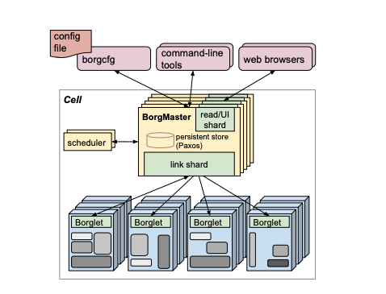

# SCHEDULING

# Introduction

## What is Borg:

Borg is a cluster manager that can run multiple applications across several clusters, where each cluster may have over thousand machines.

## What is DRF:

A big problem that shared computer systems face is that of resource allocation. This becomes particularly complex in systems containing different resource types, where each user may have different demands for each resource.

Dominant Resource Fairness(DRF) is a method proposed to resolve this precise issue. DRF is a generalization of max-min fairness on multiple resource types (that is resource of differing in their physical capabilities).

## Why use Borg?:

Borg provides the following features:
* High Availability
* Fault Tolerance and minimal fault recovery time
* Smart Scheduling that reduce probability of correlated failure.

Benefits provided by Borg:
1. Hides details of resource management and failure handling.  
-- This means the user can create & deploy applications without knowing how the infrastructure is managing resources for these applications.
2. Operates with high availability and reliability.  
3. Runs workloads across several (eg. 10000) machines effectively.  

## Terminologies:
**Borg Job**: Users work is called as Job. Each job may contain one or more tasks.  
**Borg Cell**: Set of nodes/machines that are considered as one unit. Each job is run in one cell. 
**Borg Cluster**: Machines in a cell belong to a single cluster. Lives inside a single datacenter 
**Borg Alloc**: Shorthand for Borg Allocation, an alloc is a reserved set of resources on a machine in which one or more tasks can be run. The resources will remain assigned, regardless of whether they are used or not. 
**Priority**: Attributed to every job, this is a small positive integer. Higher priority jobs preempt the lower priority ones for resources. 
**Quota**: A vector of resource quantities (RAM, CPU, disk etc), this is used to decide which jobs to admit for scheduling.  Analogous to resource limits in Kubernetes. 
**Borg Name Service(BNS)**: Borg's internal resource name resolution service. 
**Borgmaster**: Centrallized controller for a Borg Cell. 
**Borglet**: Local Agent present in every machine in a cell. 
**Checkpoint**: Borgmaster's state at a point of time is called as Checkpoint. This is a periodic snapshot and is used to build a persistent log.  
**Fauxmaster**: A high fidelity Borgmaster simulator, it is used to read checkpoint files, contains the complete BorgMaster production code with stubbed out interfaces. Communicates with simulated Borglets instead of real ones so that end-user can play them one by one and debug problems.  
**Task Startup latency**: Time from job submission to job starting. Median typically lies at 25s.
**Equivalence Class**: Group of tasks that have similar resource requirements.  
**Cell Compaction**: This is an advanced evaluation metric that determines, for a given workload, how small a cell can this be fit into.  
**Resource Reclamation**:  We estimate how many resources a particular task will require and reclaim the rest for work that can tolerate lower quality resources(bath jobs)  
**Dominant Resource** : A resource of specific type (CPU, memory, disk, ports) which is most demanded by given framework among other resources it needs. This resource is identified as a share of the total cluster resources of the same type  
**Demand Vector**: Specifies the amount of resources required by the task. e.g., ⟨1 CPU, 4 GB⟩  

# Motivation

## Borg:
The biggest problem that Google looks to solve, is the problem of scale. The amount of users they cater to, along with the volume of daily requests they get is an absurdly high number. This challenge necessitates an effective and robust platform on which the different services and product offerings can be deployed and hosted.

A good abstraction for this use case would be a cluster scheduler that can deploy jobs, move jobs in case of failure and monitor these jobs. It generally does not make sense to expose the complexity of such a system(comprising of thousands of machines), to every consumable service. This was the primary motivation behind Borg, Google's cluster management service.

## DRF:

To understand the motivation behind this proposal, we first need to address and understand the problem it looks to solve.

Resource allocation is a key building block of any shared computer system. One of the most popular allocation policies proposed so far has been max-min fairness, which maximizes the minimum allocation received by a user in the system. Assuming each user has enough demand, this policy gives each user an equal share of the resources. Max-min fairness has been generalized to include the concept of weight, where each user receives a share of the resources proportional to its weight.

Despite the vast amount of work on fair allocation, the focus has so far been primarily on a single resource type. Even in multi-resource environments, where users have heterogeneous resource demands, allocation is typically done using a single resource abstraction. 

This paper addresses the problem of fair allocation of multiple types of resources to users with heterogeneous demands, by proposing Dominant Resource Fairness algorithm. The intuition behind DRF is that in a multi-resource environment, the allocation of a user should be determined by the user’s dominant share. Thus, DRF seeks to maximize the minimum dominant share across all users. In the single resource case, DRF reduces to max-min fairness for that resource.

# Approaches
## BORG:
## Architecture:

* Borg has 3 components:
    1. Set of Machines
    2. A centrallized controller called Borgmaster
    3. Agent service called Borglets, that run on each machine in the cell.

### Borgmaster:

* Logically a single process but is replicated 5 times.
* Each replica maintains an in-memory copy of most of the state of the cell(Borg Cell), in a highly available Paxos-based store. (Leader-follower model)
* Borgmaster takes regular snapshots of it's internal state which is stored in a Paxos based store. This snapshot is called as a Checkpoint.
* Checkpoints have the following uses:
    1. Revert Borgmaster's state to a previous point in time.
    2. Build and maintain a persistent log
    3. Offline simulations (What kind ?)

###  Borglet:

* Performs the following important functions:
    1. Starts and stops the tasks.
    2. Restarts tasks whenever they fail.
    3. Manages local resources by manipulating local OS kernel.
    4. Rolls over the debug log and reports the state of the machine to the Borgmaster.

* If a Borglet does not respond to poll messages, the machine is marked as down and any tasks running on it are rescheduled to other nodes.
* In case the communication is restored, Borgmaster asks the Borglet to kill the rescheduled tasks, to avoid duplicates.
* A Borglet continues to work as normal, even if communication with Borgmaster is lost. This way there is no disruption to the service.

## Job Scheduling:

* When a new job request is submitted, Borgmaster records the job details into the Paxos based store. It then adds the job's tasks to a pending queue.
* A scheduler asynchronously reads tasks from this pending queue and assigns them to nodes/machines.
* Consider the fact that each job is assigned to a Borg Cell, and each Borg Cell has it's own Borgmaster and Borglets.
* Scheduling algorithm has 2 parts:
    1. Feasibility Checking: Finds machines where the given task can run.
    2. Scoring: Picks one of the feasible machines.
* Score tries to minimize the number and the priority of preempted tasks.

* Several Scoring strategies exist, with the three most popular being:
    1. Worst Fit: Advantage is that load is spread across all nodes, leaving room for spikes. However this is at the risk of fragmentation.
    2. Best Fit: Tries to fill machines as tightly as possible. Results in several machines having no user tasks. Disadvantage is that, this tight packing penalizes mis-estimations in resource requirements and hurts batch jobs the most.
    3. Hybrid fit: Currently used by Borg, this tries to reduce the amount of stranded resources. Provides up to 3-5% better packing efficiency that best-fit.

* Package installation takes up 80% of the total 'Task Startup latency'. Borgmaster hence, in an effort to reduce this component of the Task Startup Latency, tries to schedule tasks to nodes that already have majority of the required packages installed.

## Scalability:

* Early versions of the Borgmaster had a simple, synchronous loop that accepted requests, scheduled tasks and communicated with the Borglets.
* To handle larger cells, the scheduler process was split from Borgmaster, so that it could operate in parallel with the other Borgmaster functions that are replicated for failure tolerance.
* A scheduler replica repeatedly retrieves state changes from the elected master, updates its local copy, does a scheduling pass to assign tasks, informs the master about these assignments.
* Master will reject these assignments only if they are performed in an out of order (timestamp) fashion.

* Features that make Borg scalable:
    1. Score caching: Borg caches scores of a machine until the properties of the machine change.
    2. Equivalence Classes: Tasks in borg job usually have identical requirements and constraints. Hence, rather than determining feasibility for every task, it is rather determined for each equivalence class. 
    3. Relaxed Randomization: It is wasteful to calculate feasibilty and scores for each machine in the cell. Hence machines are randomly selected and a score is generated for them. The machine to which a task is scheduled to, is determined as the best available machine from this set of randomly sampled machines.

## Evolution from 2011:

Since Borgv2 compares the state of Borg in 2019 and 2011, following are the major changes introduced in Borgv2:

1. **Job Priority Values**: While the old trace mapped unique priority values (0, 25, 100, 101, 103, 104, 107, 109, 119, 200, 360, 450) to a range 0-11, the new trace exposes priorities as raw values in range 0-450.
2. **Normalized CPU Units**: Borg has switched to Google Compute Units(GCU) from physical core notation. However, Borg normalizes these values based on maximum machine size in the trace such that values fall into the range 0-1.
3. **Job Dependencies**: If the parent of a particular child job is terminated, the child job is also terminated. This is particularly useful for MapReduce jobs.
4. **Batch Queueing**: Borg now supports multiple schedulers, including a batch scheduler that manages the aggregate batch job workload for throughput by queueing jobs until the cell can handle them, after which the job is given to the regular Borg scheduler.
5. **Vertical Scaling**: Borg now supports vertical autoscaling via a system called Autopilot that automatically predicts a job’s resource usage, and adjusts its resource limits dynamically
6. Verbose Termination: Borg evolved it's process termination flow and as per the 2019 trace supported the following events that could lead to a termination of a job/collection:
    * FINISH: Collection completed normally.
    * EVICT: Following are the reasons for eviction:
        1. de-scheduled due to a hardware failure
        2. de-scheduled due to an OS upgrade
        3. preempted by a higher priority instance
        4. machine was over-committed and Borg had to kill one or more instances to free resources for the rest.
    * KILL: Collection was cancelled by the user.
    * FAIL: Collection was unexpectedly terminated due to some fault (eg. segfault)

## Approaches in DRF:

The biggest question that has to be answered when designing a fair allocation scheduler is how to define a fair allocation policy. The paper introduces a few properties that a fair scheduler must have and seeks to model the algorithm to these properties:

1. Sharing Incentive: Each user should be better off using the cluster than using their own partition of the cluster. 
2. Strategy Proofness: Users must not be able to improve their allocation by lying about their resource demands.  
3. Envy Freeness: A user should not prefer the allocation of another user. 
4. Pareto Efficiency: It should not be possible to increase the allocation of one user by decreasing the allocation of another user. 
5. Single Resource Fairness: For a single resource, the solution must reduce to max-min fairness. 
6. Bottleneck Fairness: If there is one resource that is percent-wise demanded most of by every user, the solution must reduce to max-min fairness for that resource. 
7. Population monotonicity: When a user leaves a system and relinquishes resources, none of the allocations of the remaining users should decrease. 
8. Resource monotonicity: If more resources are added, none of the allocations of the existing users should decrease. 

The proposed solution DRF meets all the above properties. For every user, DRF computes the share of each resource allocated to that user. The maximum among all shares of a user is called that user’s dominant share, and the resource corresponding to the dominant share is called the dominant resource. DRF simply applies max- min fairness across users’ dominant shares. That is, DRF seeks to maximize the smallest dominant share in the system, then the second-smallest, and so on.

# Trade-Offs

## Borg:
To discuss and understand tradeoffs in Borg, we first need to understand the limitations associated with it.

### Limitations:
* Borg's monolithic cluster scheduler architecture cannot deal with the increasing scale and rapidly changing user requirements and usage patterns. This restricts the rate at which new features can be deployed, decreases efficiency and utilization and can eventually limit cluster growth.

As a response to this limitation, Google has sought to integrate Omega into Borg.

### Observation:
* Utilization of Borg clusters have remained low (~60%).

* One percent of resource-hungry applications consume 99 percent of resources used. The paper suggests that’s an issue because smaller jobs end up at the back of the queue and/or fighting for resources.

* Much of the workload has moved from the free tier (low priority) into the best-effort batch tier (jobs managed by a queued batch scheduler), while the overall usage for production tier (high priority) jobs has remained approximately constant.

## DRF:

* In the absence of strictly positive demand vectors, DRF no longer satisfies the population monotonicity property.

# Comparison:

* DRF was developed for Apache Mesos. Mesos splits the resource management and placement functionality between a central resource manager and multiple frameworks such as Hadoop and Spark. It internally uses an offer based mechanism while Borg centrallizes these functions using a request based mechanism.

* DRF does not provide a granular based resource allocation unlike Borg which provides alloc sets.

* Quota allocation is handled outside of Borg, and is intimately tied to our physical capacity planning, whose results
are reflected in the price and availability of quota in different datacenters. User jobs are admitted only if they have sufficient quota at the required priority. The use of quota reduces the need for policies like Dominant Resource Fairness

# Open Questions and Future Work:

## Borg:

1. It appears that Borg is tuned to work in Google's infrastructure, solving a very specific problem of scale. How will it perform outside Google's infrastructure on other workloads?
2. Since Borg works with a more centrallized architecture, and while things are geared to work even if the Borgmaster goes down, how will the system cope, if a majority of the system architecture goes down?

## DRF:

1. Can resource fragmentation be minimized without compromising fairness.
2. How can fairness be defined when tasks have placement constraints(machine preferences).
3. Can DRF be used as an operating system scheduler?