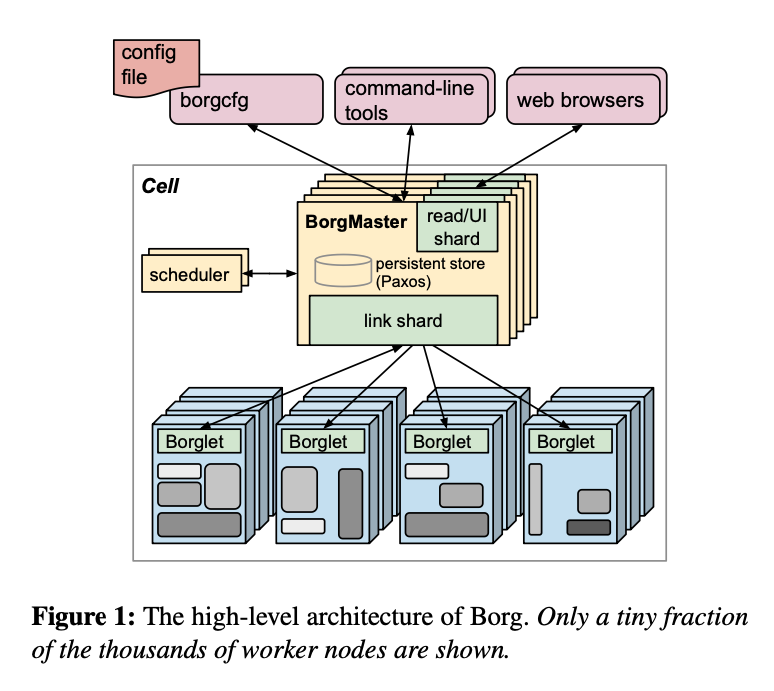
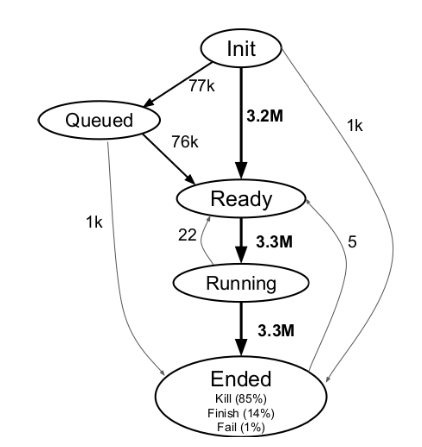
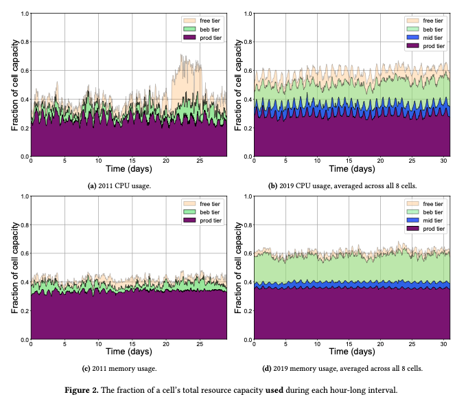
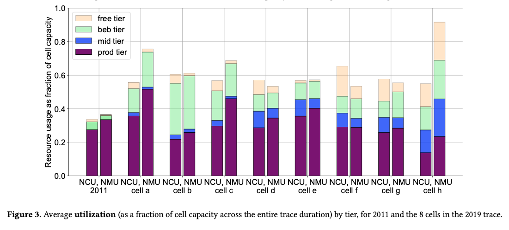
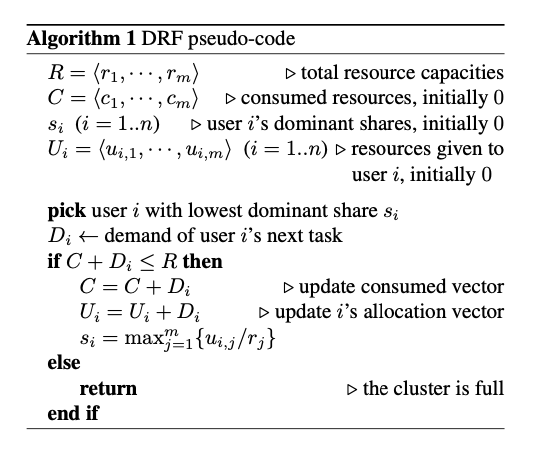
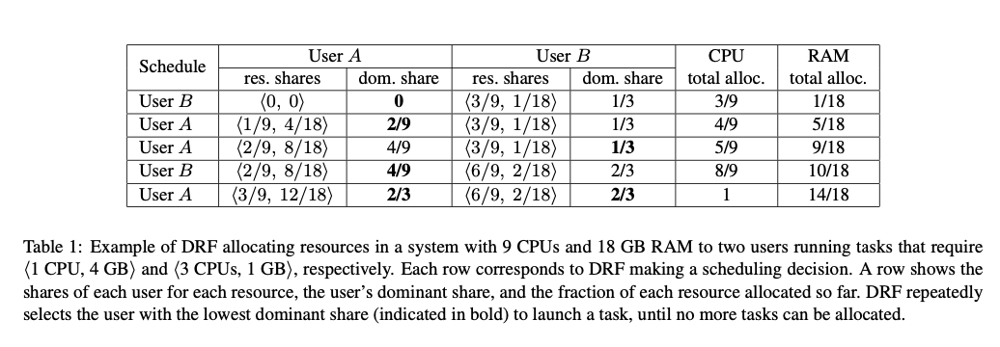

# Introduction
Resource allocation has been an important aspect of any computing system shared by multiple users. Users submit jobs with varied resource requirements (eg. 1GB memory, 2 CPUs, etc). In an environment with machines of heterogeneous sizes, we need to schedule jobs such that resource utilization can be maximized, and at the same time, no user is left hungry for resources. 

### Max-min fairness
One of the most widely used algorithms is max-min fairness, wherein resources are allocated in order of increasing demand such that no user gets a resource larger than what they asked for, and all users with unsatisfied demands receive equal resources.

### Problems and Motivation
Though the max-min fairness algorithm works well for a single resource environment, it falls short in the case of multi-resource environments where the users have heterogeneous resource demands and max-min fairness still uses a single parameter for resource allocation. This leads to under or overutilization of resources and not so fair resource allocations. With more users shifting to cloud computing, and the same datacenters being utilized by large as well as small consumers, we do not want the large consumers (resource hogs) to unfairly get all the resources while the small consumers (resource mice) starve for resources. At the same time as the resource requirements become more heterogeneous, we want to increase the overall utilization of resources.

Below we look at a few approaches and see how they perform.

# Approaches

## Borg
With warehouse-scale computing comes the need to manage each of these warehouse-scale clusters, where tens of thousands of machines run together. This cluster management software is required to achieve high utilization by combining admission control, task-packing, performance isolation, etc. all while sharing these machines between users.

Borg is in charge of admits schedules, starts, restarts, and monitoring all applications that Google runs. The benefits of Borg are:

* Hides resource management and failure handling from end-users.
* Is highly reliable and available.
* Facilitates effective execution of applications across thousands of systems.

### Definitions:
**Task**: The smallest unit of execution, ie. the program/binary to be executed.  
**Jobs**: A group of one or more tasks.  
**Cell**: Set of machines managed as a single unit. Median size 10k.  
**Cluster**: Datacenter scale network fabric that connects machines in a cell, which resides in a single building. Usually hosts one large cell but may also contain test/special purpose cells.  
**Site**: Collection of cluster buildings.  
**Alloc**: Set of resources on a machine in which 1/more tasks can be run. These resources are assigned together and the user may use them as he requires. Say, one task in an alloc could be a webserver, while another might be the log analyzer and another, a task to store the logs to NAS. These tasks go together. Log analyzer is useless without the webserver. If the alloc is relocated, all the tasks inside it are rescheduled.  
**Alloc set**: Group of allocs that reserve resources on multiple machines.  
**Quota**: Vector of resource quantities (CPU, memory, etc) at a given priority, used to decide which jobs to schedule.  
**Borg name service**: Name service maintained by Borg that includes cell name, job name, task number, associated with a host and port number.  

### Types of jobs (low to high)
**Free tier**: Jobs with lowest priorities and no Service Level Objectives (SLOs).  
**Batch jobs**: Jobs that take anywhere from few seconds to multiple days to execute. Less sensitive to performance fluctuations, managed by the batch scheduler.  
**Mid-tier**: Jobs with SLOs weaker than Prod tier jobs.  
**Prod tier**: Critical long-running, latency-sensitive services that should never go down such as Google search, Gmail, etc.  
**Monitoring**: Jobs critical for the functioning of infrastructure, including ones that keep track of the overall functioning of the cluster itself.  

* We will refer to Prod and monitoring jobs as prod jobs and the rest as non-prod/batch jobs.
* A high-priority job may preempt a low-priority job.
* Jobs with the same priority can not preempt one another.
* If a job has a parent job that gets killed, the child job is automatically killed.
  
### Pointers about Borg:
* Machines are of heterogeneous sizes (different CPU, memory, disk, network, etc).
* Borg isolates users from these differences while allocating resources, installing programs, monitoring them, etc.
* Users can specify constraints and properties for tasks as preferences or requirements.
* A job runs in just one cell.
* Users can change the properties of tasks in a running job by pushing new configurations.
* Tasks can perform cleanup when SIGTERM signal is received, before preempting the job via SIGKILL.
* Quota checking is part of admission control, not scheduling. Quota allocation is done outside of Borg.
* Users overbuy resources to insulate against future shortages of resources. Borg oversells quota at lower priority to gain better utilization.
* Monitors the health check URLs and restart tasks that do not respond/return error codes.
* All job submissions and events are written into a read-only data store for debugging, usage-based charging, and capacity planning.
* Borg supports multiple schedulers. Batch scheduler managers batch jobs for throughput by queueing them, after which they are handed over to the Borg scheduler.
  
### Architecture
A Borg cell consists of a set of machines with 2 components- Borgmaster and Borglet.

#### Borgmaster
* Consists of 2 processes: main Borgmaster process and separate scheduler.
* Handles client requests that either mutate job states (create/update/etc) or provide read-only access (lookup job).
* It also manages states for all objects in the cell- machines, tasks, allocs, etc.
* Communicates with Borglets.
* Replicated 5 times. Each copy maintains a cell state in a Paxos-based store on local disks.
* Paxos elected leader maintains state called checkpoint to restore Borgmaster's state after failures.
* When a job request is submitted, Borgmaster records it and puts the job as pending.
* The scheduler scans the list of tasks and assigns them based on resource availability and priority.

#### Borglet
* Borglets are local Borg agents present on every machine in the cell. Its job is to start, stop, restart tasks, manage resources and report the state of the machine to the Borgmaster among others.
* Borgmaster polls each Borglet in fixed intervals to get the machine's current state and send pending requests if any.
* Borgmaster replicas maintain link shards with the Borglet to handle communication.
* If a Borglet fails to respond to poll messages, the machine is marked down and the assigned tasks are rescheduled on other machines.

#### Scheduling
* Divided into 2 parts: feasibility checking and scoring.
* Feasibility checking finds machines that meet the task's constraints and have enough available resources.
* Scoring takes user preferences into account, minimizes preemption of tasks, picks machines that already have the packages required on them, putting a mix of prod and batch jobs, etc.
* Scoring method tries to reduce resources that cannot be further allocated because another resource is fully allocated.
* If a selected machine doesn't have enough resources, the lower priority jobs are preempted, from lowest to highest priority. The preempted tasks are added to the scheduler's pending queue.
  
#### Scalability
* The scheduler is a separate process in the Borgmaster.
* The scheduler makes a few optimizations to become more scalable such as score caching, equivalence classes, relaxed randomization.
* **Score caching**: Calculating feasibility and scores every time is expensive, so the scores are cached and if there are any changes in the machine state, the score is recalculated.
* **Equivalence classes**: Tasks in Borg jobs usually have similar requirements and constraints. So rather than calculating feasible machines for all tasks, Borg does feasibility and scoring for one task per equivalence class- a group of tasks with identical requirements.
* **Relaxed randomization**: Rather than doing a feasibility analysis on all the machines in a large cell, Borgmaster only calculates feasibility and scores in random order until it has found enough feasible machines, and selects the best among them.
  
#### Availability
Failures are a common phenomenon in large-scale systems. Naturally, Borg tries to mitigate the impact as much as possible.
* Tasks of a job a spread across machines, racks, power domains to reduce correlated failures.
* Evicted tasks are automatically rescheduled.
* Limits task disruptions and the number of tasks of a job that can be taken down simultaneously due to maintenance activities.
* Uses idempotent mutating operations so that failed clients can resubmit forgotten requests.
* Rate limits scanning for available machines when they become unreachable since they could be due to large-scale failures.
* Avoids machine-task pairings that cause task/machine failures.
* Repeatedly runs logsavers to ensure intermediate critical data is available even if the attached alloc was terminated/moved to another machine.
* Tasks keep running even if Borgmaster/Borlet is down.

#### Utilization
* Jobs have several constraints and we need to handle workload spikes as well. There are also batch jobs running the same machines as prod jobs. The average utilization metric is not very helpful in giving a correct utilization metric.
* Cell compaction is used instead, where given a workload, we see how small a cell can the workload fit in by removing machines.

Several optimizations are made to gain high utilization:
* **Cell sharing**: Prod and non-prod jobs run on the same machines. If we segregate these jobs into separate cells, we'd require 20-30% more machines to run workloads. This is because non-prod jobs can be easily preempted in case a new prod requirement arises, however with only prod jobs running on the machines, the prod job cannot be preempted and thus requires more machines.
* **Large cells**: Large cells reduce resource fragmentation.
* ** Fine-grained resource requests**: While most IaaS providers provide fixed sizes of hosts, providing users the fine-grained control over how much of a particular resource they require allows for better utilization (30-50%). This is because a lot of the uses may only use 0.1% CPU but might have to select 0.5/1 whole CPU. This leads to wasted resources.
* **Resource reclamation**: Users often overprovision resources to safeguard against spikes in traffic, or to safeguard against getting killed due to extra RAM usage. Borg estimates actual utilization and reclaims the rest of the resources by assigning batch jobs. The batch jobs are preempted if the load on the prod task increases. 20% workload runs in the reclaimed resources.

#### Isolation
* Sharing machines between tasks requires mechanisms to prevent interference, both in terms of security and performance.
* **Security isolation**: Tasks are isolated using Linux chroot jail. For debugging, borgssh is used, which collaborates with Borglet to construct an ssh connection in the same chroot and cgroup as the task.
* The public-facing cells use VMs and security sandboxing techniques to isolate resources.
* **Performance isolation**: Borg tasks run inside Linux cgroup based resource containers. Borglet manipulates container settings giving fine-grained control.
* Prod jobs, if required are capable of starving batch jobs running on the same machines.
* Compressible resources, such as CPU, I/O, etc can be rate-limited (reduced quality) and non-compressible resources such as memory, disk, etc can't be reclaimed without killing the tasks, starting from the lowest priority.
  
### Evolution
Traces from 2011 and 2019 have been compared to see how the workload and utilization have evolved over the years. In the 2019 trace, more data has been added about things that were missed in the 2011 trace. Borg uses Google Compute Units (GCU) instead of CPU cores so that 1GCU provides roughly the same amount of computational power everywhere.

#### Changes in Borg and new trace properties
* The 2019 trace contains data from 8 cells instead of just one in 2011.
* Previously, over-allocating memory would cause an eviction, which is not the case anymore and over-allocation is now comparable to that for CPU.
* Alloc set information is now included in the 2019 trace.
* 2011 traces reported high task failure rates, which was because the failures weren't bucketed. Most of the failures were because of users directly or indirectly canceling jobs. There are 4 types of terminations- finish, evict, kill and fail.
* Finish is simply success; evict is when there is a hardware failure or a forced OS upgrade; kill is when a user cancels a job; and fail, when an instance is unexpectedly terminated due to a problem of its own, such as segfault.
* Only 3.2% of jobs experience evictions and 96.6% of those are batch jobs.
* Users initiate most kill events. While reasons for user evictions are not available for obvious reasons, we also see that of all kill events, 87% of jobs with parents receiving a kill and 41% of jobs without a parent receiving a kill. This explains the high number of kills reported earlier.

#### Resource Utilization
* We see that the workload varies significantly across cells. Cell b has the largest proportion of best-effort jobs, while cell a has the largest proportion of production jobs, and cell a has the highest number of mid-tier jobs.
* There is also a large variation in usage in various resource dimensions. Cell a and h have large memory and CPU usage variation.
* Both CPU and memory are consistently allocated above 100% of deployed capacity. Borg is using statistical multiplexing to over-commit resources.
* Overall machine utilization in 2019 has increased at all but the highest percentiles.
* The median overall utilization has increased 20-40% for CPU and 3-30% for memory.
* Variation in utilization is lesser in 2019, meaning Borg is able to show better utilization consistently.
* There are fewer machines with overall utilization > 80% in 2019. This means the workload is better distributed across the cell, avoiding over and underutilization.

#### Scheduling load
* Mean job arrival rate has increased by 3.5x, the median rate has increased by 3.7x and p90 has grown by 3x.
* Scheduling load has increased about 3.6x from 2011.
* A lot of the scheduling events are for rescheduling, indicating a lot more churn in the current system.
* With an increase in job submissions, we'd expect the scheduling delay to increase as well.
* To analyze this, the transition time from READY to RUNNING was checked, while ignoring batch scheduler delays.
* The median delays have decreased, though the tail is longer for 28% of the jobs. Most long delays are with best effort batch and mid-tier jobs. Prod jobs are scheduled significantly faster than in 2011.
  
#### Resource consumption
* There is a direct correlation between memory and CPU usage (Pearson correlation coefficient 0.97).
* There is a huge variation in CPU and memory usage across workloads.
* The largest 1% jobs comprise 99.2% of the CPU load and 99.1% of the memory load.
* The largest 0.1% jobs comprise 93.1% of the load.
* The largest 1% jobs are termed hogs and the rest 99% as mice.
* Variation in resource usage is not that different across years, with 2011 data somewhat less variable (4x less variable than 2019) and less heavy-tailed. Characterization of jobs as mice and hogs holds across years.
* We know that queueing delay is directly proportional to the coefficient of variance of job requirements. With the high variance in CPU and memory usage, the queueing delay is bound to be high.
* If we can find a way to isolate the schedule hogs from the mice, the mice would be prioritized and scheduled faster.
  
#### Vertical Scaling
* Also known generally as autoscaling, a feature that automatically adjusts a job's resources based on the job's resource usage.
* Supports 2 strategies- not autoscaled, fully autoscaled, or autoscaled with constraints.
* Reduces the slack resources as far as possible- the difference between requested and actually used resources. This translates to higher efficiency.
* Uses historical data from previous runs of same or similar jobs to configure initial resource request and adjusts limits as the job executes.
* We see that fully autopilot jobs had the least slack of all other types, even better than constrained jobs

## DRF

### Dominant Resource Fairness (DRF)
DRF is a new allocation policy that satisfies all the required properties of a fair algorithm in a multi-resource environment. It works as follows:
* The algorithm first calculates the share of each resource allocated to that user.
* The maximum share across different resource types is called the user's dominant share and the corresponding share is called the dominant resource. For example, a user with a huge computation-intensive job will have dominant resource as CPU.
* DRF then applies max-min fairness across users' dominant shares, i.e. maximizing the smallest dominant share first, and then the second smallest share, and so on.

#### What does it mean to allocate fairly?
Being fair is very vague and people can come up with all sorts of heuristics that can be deemed fair, however in the context of resource allocation, we highlight a set of required properties that guide a fair allocation strategy:
* **Sharing incentive**: A user should be better off sharing a resource rather than using their partition of the cluster. For instance, in a cluster with n users, each user should get at least 1/n of all the resources. If the user gets more than 1/n of the resources, the user is automatically incentivized.
* **Strategy proofness**: Users should not be able to benefit by lying about their resource requirements. For instance, in Yahoo! Hadoop MapReduce datacenters, a user discovered that all the map slots were contended, so the user launched all its jobs as reduce phases.
* **Envy-freeness**: A user should not prefer the allocations of another user. TODO give details.
* **Pareto efficiency**: Pareto Efficiency indicates that resources can no longer be allocated in a way that makes one user better off without harming other users. In Pareto Efficiency, resources are allocated in the most efficient way possible maximizing system utilization.

In addition to the other properties, there are a few other good to have properties:
* **Single resource fairness**: For single resource allocation, the solution should reduce to max-min fairness.
* **Bottleneck fairness**: If the same resource is required most by all users, the solution should reduce to max-min fairness.
* **Population monotonicity**: If a user releases their resources, none of the allocations of other users should reduce (as a consequence of re-allocation).
* **Resource monotonicity**: If more resources are added to the system, none of the allocations of other users should reduce.

The above pseudo-code is for DRF scheduling. The algorithm tracks the consumed resources, picks the user with the smallest dominant share, and allocates resources if available. The algorithm does not specify what happens when a task completes for simplicity. In this case, the resources are released, and the available capacity is updated.

#### Illustration:
* Consider a system with 9 CPUs and 18 GB memory denoted by resource vector <9, 18>.
* User A has a demand vector <1 CPU, 4BG memory> and User B has demand vector <3 CPU, 1GB memory>.
* A consumes 1/9 CPU and 4/18 memory. Hence A's dominant resource is memory.
* B consumes 3/9 CPU and 1/18 memory. Hence B's dominant resource is CPU.
* Initially the dominant shares of both A and B are 0 since nobody has been allocated any resource.
* DRF first picks B to run a task, since dominant shares both are 0 and either can be picked.
* Now B's dominant share is 1/3 and that of A is 0. So, A is picked next.
* At each step, the user with the lower dominant share is picked up and appropriate resources are allocated.
* The rest can be seen in the table below.
* Finally, the whole CPU gets allocated with the dominant shares of both A and B as 2/3. No further allocations can be done.

#### Weighted DRF
While DRF provides us a fair resource allocation algorithm that works for multi-resource environments, there are often situations where some jobs need to be prioritized over others. To achieve this, we have the weighted DRF. Here, each user has an associated weight for each resource. For user i, let the weight vector be Wi = <wi1, wi2 ... win> where n denotes the resource. The dominant share is thus si = maxj{uij/wij}, where uij is the user's share of the j-th resource.

# Trade-offs
## Borg
* Borg is an entire system and not a strategy that can be applied everywhere in a generic manner like DRF.
* Borg differentiates between different types of jobs to achieve high utilization. However, this approach is not possible outside a company where everyone competes for high priority.
* Borg provides a huge variety of configurations which makes it harder for casual users to create a meaningful configuration.
* Borg is not strategy proof. Borg uses priorities and just by the virtue of being a production job, you can preempt a batch job. While this would work fine within a company, this cannot be used with outside customers.

## DRF
* DRF does not follow resource monotonicity. Though a rare occurance, it can cause unnecessary deallocations of tasks.
* A user that has low resource requirements has a better chance of getting scheduled first as compared to resource heavy tasks. This can cause delays in scheduling resource hogs like in the case of Borg where 99% jobs are mice. As smaller tasks come in, they may be allocated first and the larger tasks would keep on waiting.

## Comparison
* While Borg works very well as a whole system, it is not a general strategy that people can apply in different kinds of scenarios while DRF can be more generally applied anywhere.
* While Borg has a preference for prod jobs, DRF seems to inherently prefer resource mice.
* Borg allows jobs to be scheduled even if all the required resources are not available using a set of minimum required resources, while the job will not be scheduled in the case of DRF.
* The concept of alloc sets is very useful in real life. However, such fine grained control is not available in DRF. The user would simply have to request a cumulative resource instead.

# Open Questions and Future work
* We have seen that large cells reduce resource fragmentation. How large can a cell grow before the complications in management of such cells overweights the reduction in fragmentation?
* What makes AWS schedule times much faster than that of GCE?
* How can resource hogs and mice be isolated from one another so that the mice do not experience high queue times?