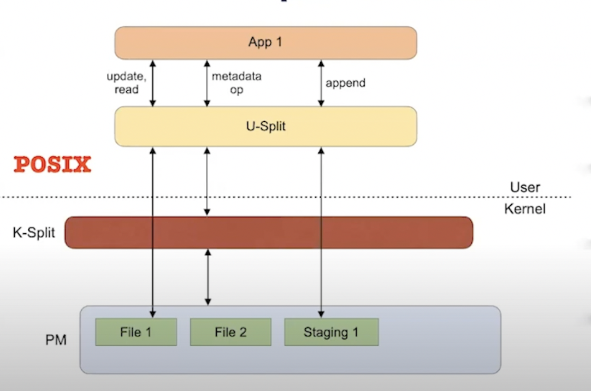
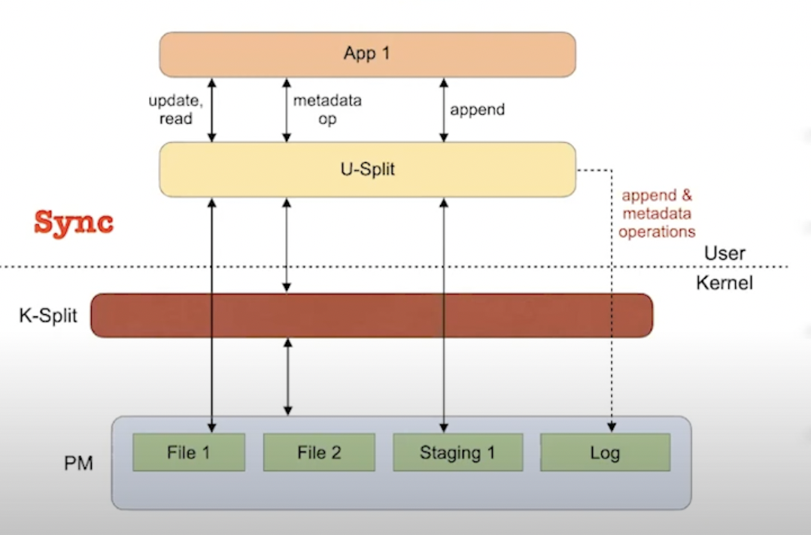
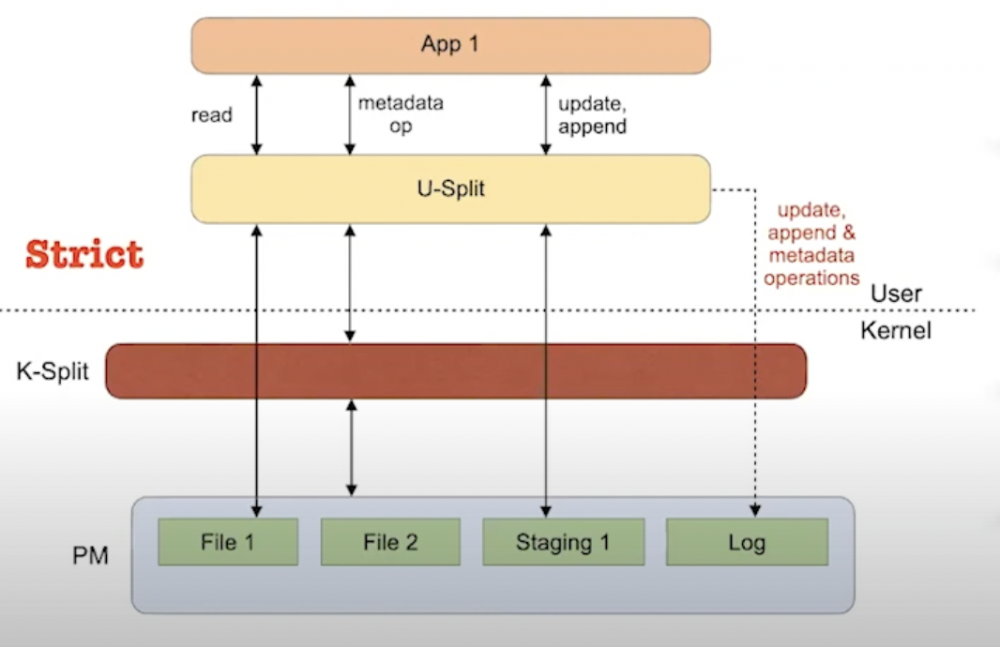

# Intel Optane

## Introduction 
Intel has recently released the Optane DC PMM which is a scalabale, non volatile memory that provides
byte granularity and survives power outages. Optane provides non volatile memory with a speed slightly
lesser than that of DRAM based main memory and faster than that of SSDs.

## Motivation
Till now memory is either slow, large and cheap or fast, small and expensive. Due to this, the kind 
of memory being used has always been a major bottleneck in many applications. This is the area that 
Optane tackles. It provides fast memory, much faster than SSDs and slightly slower than DRAMs and a 
single CPU can host six Optane DC PMMs for a total of 3TB of Optane DC memory. 

## Approaches
-   Like traditional DRAMs, Optane DC PMM also sits on the memory bus and connects to the on board memory 
controller. 
-   Optane currently comes in three capacities - 128 GB, 256 GB and 512 GB - and the performance
numbers in this report are for the 256 GB version. 
-   Optane can operate in 2 modes - Memory mode and App Direct Mode

Memory mode uses Optane to expand main memory without persistence. It combines an Optane with 
a conventional DRAM that serves as a direct-mapped cache for the Optane. The CPU's memory controller 
manages the cache transparently. The CPU and operating system simply see a larger pool of 
main memory. This mode is also referred to as cached.

App Direct mode is useful for building storage systems out of Optane. The Optane appears as a separate, 
persistent memory device. There is no DRAM cache. Optane aware applications and the file system 
can access Optane with load and store instructions and use the ordering facilities mentioned 
above to enforce ordering constraints and ensure crash consistency. This mode is also referred to as
uncached.

#### Basic Optane DC Performance

######Latency 
On average, random loads take 305 ns compared to 81 ns for DRAM accesses on the same platform. 
For sequential loads, latencies are 169 ns, suggesting some buffering or caching inside the Optane.
The write latency is 94 ns for Optane compared to 86 ns for DRAM.

######Bandwidth

#### Optane as Main Memory Performance

This figure compares the performance of SPEC 2017 running on cached Optane DC and uncached 
Optane normalized to performance using DRAM. The working sets of the SPEC 2017 applications are all 
small enough to fit in the DRAM cache. For the integer workloads, cached Optane is just as fast 
as DRAM, and uncached Optane DC is 38% slower. Floating point performance, however, drops 15% 
with cached Optane DC and 61% with uncached. The poor performance in cached mode is surprising, 
and we do not yet sure of the root cause. It maybe due to the limited write bandwidth.

#### Optane as Persistent Storage

#### Optane as Persistent Memory

## Trade Offs
-   Persistent Memory itself isn't crash consistent. Needs a lot of additional coding.
-   Still not as fast as DRAMs

## Open Questions and Future Work
-   Can modifications be made to make it crash consistent?
-   Can it be made as fast as DRAMs?

# Persimmon

## Introduction
Recently distributed in-memory storage systems are ubiquitous. These include key value stores 
like memcached and redis and replicated systems like TAPIR and NOPaxos. By storing all data in
DRAM, these In-Memory systems can provide high performance. By using techniques like kernel bypass,
these systems bring the latency down to the scale of microseconds in datacenters. However,
In-Memory systems lack persistence. This means that in case of a node failure, it would mean that all
data is lost and can only be recovered from a replica which is highly resource intensive and time
consuming.

Persistent Memory (PM) helps overcome this problem. PM is durable and offers performance close to
DRAM and is available in large sizes. Persimmon focuses on using PM to in-memory storage system in
order to make it persistent.

## Motivation
Porting In-Memory systems to PM is much harder than it looks. This is because PM does not provide
crash consistency. The operations need to persist all or nothing. For crash consistency on PM 
applications typically use logging to guarantee recoverability and atomicity of application level 
operations. In some scenarios they can get away with not logging by carefully flushing volatile 
CPU states in the right order. 

Even though porting in-memory systems can be done it requires highly complex code while very carefully
managing extremely tricky aspects such as separating the persistent application states from the 
volatile states. Also, it can incur high overhead as even though PM is much faster than SSDs, it is 
still slow compared to DRAMs. So, we need a way to use PM to provide persistence with minimal programming
effort and performance overhead.

## Approaches
In-Memory storage systems are implemented as RPC processing state machines. State machines in general
have the following properties:
-   They encapsulate some state
-   They have only atomic operations
-   They execute operations deterministically

Persimmon uses state machines as abstraction to persistent memory as in this case, the earlier
mentioned issues of crash consistency can be solved. Persimmon works because:
-   The state machine encapsulates the state that needs to be persisted and recovered.
-   Since each state machine operation is atomic, each operation is a unit of persistence, thereby 
making it crash consistent.
-   The determinism of the operations allows us to achieve fast persistence by logging. 

Persimmon is a user-level runtime system that provides persistence to in-memory state machine 
applications. Persimmon works by keeping two copies of the application state machine one in DRAM 
and one in PM connected by a persistent operation log. This ensures persistence with low latency overhead. 
When handling RPCs, an application running on Persimmon follows the normal logic while logging 
the same machine operations to the persistent log. This ensures that the operation is never lost 
and is fast as it requires only one sequence to write to PM. To prevent the log from growing
unboundedly, Persimmon uses a background process called the Shadow Execution to digest the log 
by re-executing the operations on the PM state machine. This ensures crash consistency by dynamically
instrumenting the application supplied operations to perform undo logging. 

Persimmon applies to applications whose core logic can be modeled as a state machine. The machine
operations are arbitrary application code that:
-   Do not have external dependencies
-   Execute deterministically
-   Have no external side-effects
The state machine model implicitly assumes that the applications applies operations sequentially.

Therefore, Persistent State Machines (PSM) guarantees:
-   Linearizability
-   Durability
-   Failure Atomicity

#### Design

Every application running on Persimmon is split into two processes - the foreground application 
process and the background shadow process each running on a separate CPU core. The Persimmon runtime 
exists in both processes and maintains the DRAM and PM state machines as well as the operation log
which also lives in persistent memory. 

When an RPC comes in the application invokes a persimmon operation which persimmon executes 
immediately on the DRAM state machine and if it is a read write operation also inserts it into 
the operation log. The application can now respond to the RPC. Asynchronously, the shadow 
process pulls operations from the log and shadow executes them on the pm state machine. The shadow
execution occurs on pm and thus requires crash consistency. 

However, naively re-performing the application supplied operations on PM would violate crash 
consistency. To avoid this, Persimmon uses dynamic binary instrumentation for undo logging during 
the shadow process. Before memory write, we insert a function call that records the original 
value as a destination in the persistent undo log and then let the memory write go through. When
the entire state machine operation finishes we make sure that all rights have persisted and then 
we can clear the log. If a crash does occur, we copy the undo log entries back to their original 
locations as rolling back any partially executed operation.

The performance of undo logging is very important for shadow execution throughput and so Persimmon
has multiple optimizations specifically for undo logging. They are: 
-   Skipping the stack
-   De-duplicating undo log entries
-   Fast-path de-duplication check
-   Batch commit
-   Skipping newly allocated regions

#### Performance
Persimmon requires very little code modification.

The following graph shows recovery capacity of Persimmon.

## Trade Offs
-   Requires two CPU cores and two times the space
-   Shadow execution on high percentage of read write operations could affect the application's
throughput
-   Doesn't work for multi threaded applications

## Open Questions and Future Work
-   How can we use PM for multi threaded applications

# SplitFS

## Introduction
The advent of Persistent Memory (PM) gives rise to new avenues for creating file systems which 
exploit PM. SplitFS is a POSIX file system that aims to reduce software overhead for PM where the 
data operations and metadata operations are split. The data operations are handled by the user 
while the metadata operations are handled by the kernel.

## Motivation
If we want to append 4KB data to a file, the time needed to copy user data to the PM is only 
around 700 ns. However, while using the currently existing file systems, it takes much longer 
due to software overheads. The most commonly used file system - ext4-DAX - takes 9002 ns which is
almost 12 times the ideal time. In fact, ext4-DAX suffers from the highest software overhead and
provides weak consistency guarantees. The goals of SplitFS therefore, are: 
-   Low Software Overhead
-   Strong Consistency Guarantees
-   Leveraging the maturity and active development of ext4-DAX

## Approaches
SplitFS as mentioned earlier is a POSIX file system that aims to reduce software overhead for PM. 
It serves data operations from the user space and metadata operations using the ext4-DAX kernel 
file system. It also provides strong guarantees such as atomic and synchronous data operations.

SplitFS is targeted at POSIX applications which use read() and write() system calls to access their 
data on PM. Also, SplitFS does not optimize for cases when multiple processes concurrently access 
the same file. 

#### High-level Design
SplitFS is designed in such a way that it achieves high performance with low complexity. The high 
performance is made possible by accelerating the data operations from user space. Data operations 
are more common and simple. The low complexity is achieved by not performing the metadata operations 
from the user and rather executing them from the kernel using the pre-existing ext4-DAX. Since, 
metadata operations are much more rare and complex and since POSIX has many complex corner cases, 
using ext4-DAX for metadata operations reduces complexity.

SplitFS accelerates the common case data operations while leveraging the maturity of ext4-DAX for 
metadata operations. Moreover, SplitFS uses logging and out of place updates for providing atomic 
and asynchronous operations.

#### Handling Data Operations

###### Handling File Reads and Updates

The above image gives an idea about how data reads and updates are performed in SplitFS. When we
perform a read or an update the U-Split performs a memory map of the file. However, it doesn't 
memory map the whole file. It mmap()s only 2MB chunks of data that the application was trying to read.
So after we do a mmap(), the kernel is no longer involved and we will directly access the persistent 
memory as shown above. Once the memory map has been set up, the application can very easily perform a 
mem copy. So, SplitFS maintains a list of mmap()s per file to satisfy file reads and updates. Therefore, 
in the common case, file reads and updates do not pass through the kernel.

###### Handling File Appends
SplitFS uses temporary files called staging files for both appends and atomic data operations. 
Appends are first routed to a staging file, and are later relinked on fsync(). Similarly, file 
overwrites in strict mode are also first sent to staging files and later relinked to their appropriate 
files. On an fsync(), all the staged appends of a file must be moved to the target file; in strict mode, 
overwrites have to be moved as well. The standard approach of allocating new blocks and copying the 
appended data to them would lead to high overhead and write amplification. 

Relink logically moves PM blocks from the staging file to the target file without incurring any copies.
Relink atomically moves data from offset1 of file1 to offset2 of file2. If file2 already has data at 
offset2, existing data blocks are de-allocated. Atomicity is ensured by wrapping the changes in 
a ext4 journal transaction. Relink is a metadata operation, and does not involve copying data 
when the involved offsets and size are block aligned.

This approach can be visualised using the figure below.

Every application has a configurable number of staging files. More staging files are created and mapped
in the background as they are used up. The staging file regions aren't unmapped on relink. Infact, the
same mapping is reused for the target files. Also, as mentioned earlier, metadata for a collection of 
memory mappings per file is maintained. This is done by the U-Split. These mappings are logically moved
from the staging file to target files without unmapping. 

#### SplitFS Modes
###### POSIX

###### Sync

###### Strict

#### Optimized Logging
SplitFS employs a per-application log in sync and strict modes which logs every logical operation.
In the common case, each log entry fits one cache line and each log entry is written directly
to PM using DAX-mmap. Since each application has a separate log and separate U-Split, a different 
mode can be used for each application.

#### Consistency Guarantees

#### Visibility
-   All metadata operations are immediately visible to all other processes
-   Writes are visible to all other processes on subsequent fsync()
-   Memory mapped files have the same visibility guarantees as that of ext4-DAX

#### Techniques

#### Performance
As mentioned earlier, if we want to append 4KB data to a file, the time needed to copy user data 
to the PM is only around 700 ns. Looking at the following graph,

it can be clearly seen that the strict mode of SplitFS performs much better than even Strata which
was the best till now.

## Trade Offs
-   SplitFS does not optimize for applications accessing memory mapped files
-   SplitFS includes overheads of ext4-DAX on all metadata operations
-   File access and modified times are not reflected immediately

## Open Questions and Future Work
-   Instead of using ext4-DAX, other file systems could be tried for metadata operations

