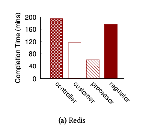

# Introduction

The data economy demands a new approach to antitrust rules. This week's papers discuss - 

- Implementation of GDPR compliant databases - effects on performance 
- Obliviously and efficiently implementing serializable ACID transactions on top of untrusted cloud storage 
- Differential privacy to aggregate data without leaking individual data points

## GDPR

The General Data Protection Regulation (GDPR) provides new rights and protections to European people concerning their personal data. 
The paper analyses GDPR from a systems perspective, translating its legal articles into a set of capabilities and characteristics that compliant systems must support.

While databases are generally optimised for performance, introduction of GDPR constraints affects performance.
aim to understand and evaluate GDPR compliance of existing database systems.

#### What is GDPR?
- GDPR declares the privacy and protection of personal data as a fundamental right of all European people. It grants several new rights to the EU consumers including 
    - right to access, 
    - right to rectification, 
    - right to be forgotten, 
    - right to object, 
    - right to data portability. 
- GDPR also assigns responsibilities to companies that collect and process personal data. These include 
    - seeking explicit consent before using personal data, 
    - notifying data breaches within 72 hours of discovery,
    - maintaining records of processing activities, etc.

#### Impact on Storage & Database Systems
- **Metadata explosion**: Every personal data item has to be associated with up to seven metadata properties that govern
 its behavior.
- GDPR’s goal of data protection by design and by default conflicts with the traditional system design goals of optimizing for performance, cost, and reliability.
- GDPR allows **new forms of interactions with datastores** . Raises need for new benchmark.

### Approaches
- GDPR’s interpretation of personal data is broad as it includes any information that relates to a natural person, even if it did not uniquely identify that person. This has made compliance challenging, and translating 
- GDPR’s goal of data protection by design and by default conflicts with the traditional system design goals of optimizing for performance, cost, and reliability. 

**Design and Implementation of GDPR bench**

**GDPR Entities**

Workload | Purpose 
---------|----------
Controller| Management and administration of personal data
Customer | Exercising GDPR rights 
Processor| Processing of personal data
Regulator|Investigation and enforcement of GDPR laws

**GDPR Queries**
GDPR query | Description
---------|----------
Create-Record| To allow controllers to insert a record containing personal data with its associated metadata 
Delete-Record-by-{KEY\|PUR\|TTL\|USR} | To allow customers to request erasure of a particular record (§ 17); to allow controllers to delete records corresponding to a completed purpose, to purge expired records, and to clean up all records of a particular customer
Read-Data-by-{KEY\|PUR\|USR\|OBJ\|DEC}| To allow processors to access individual data items or those matching a given purpose; to let customers extract all their data ; to allow processors to get data that do not object to specific usage or to automated decision-making 
Read-Metadata-by-{KEY\|USR\|SHR} | To allow customers to find out metadata associated with their data to assist regulators to perform user-specific investigations, and investigations into third-party sharing
Update-Data-by-KEY| To allow customers to rectify inaccuracies in personal data
Update-Metadata-by-{KEY\|PUR\|USR} |To allow customers to change their objections (G 18.1) or alter previous con- sents; to allow processors to register the use of given personal data for automated decision making; to en- able controllers to update access lists and third-party sharing information for groups of data
Get-System-{LOGS\|FEATURES}|To enable regulators to investigate system logs based on time ranges, and to identify supported security capabilities 

**Performance evaluation**
- The workloads were evaluated on 3 databases
    - Postgres: relational DB
    - Redis: noSQL, in memory
    - System-C  

**How do the databases perform against GDPR workloads?**
Redis | Postgres | System-C
---------|----------| ----------
| | 

- Completion times for postgres are an order of magnitude faster than redis (across all 4 workloads)
- PostgreSQL, being an RDBMS, is better at supporting complex queries efficiently.
    - But, this is acheived by the use of secondary indices for the metadata.
    - Addition of these indices increases storage space overhead from 3.5x to 5.95x. 
- System-C’s built-in query result cache was able to significantly improve the performance of read-only workloads such as the processor.

**What overhead is incurred due to GDPR security features?**

Redis | Postgres | System-C
---------|----------| ----------
| | 

- The security features introduced affect all read and write operations, resulting in reduced performance.
- Features such as logging can result in significant performance degradation, making GDPR compliance challenging for production environments.
- When all the features are enabled in tandem, (compared to it's baseline performance)
    - Redis experiences a slowdown of 5×.
    - PostgreSQL slows down by a factor of 2×.
    - System-C  performance degradation of 2-3×.
-  All three systems experienced drastic overhead in supporting range queries.
- Administrators should look beyond the binary choice of whether or not a GDPR feature is supported, and analyze if a given implementation meets the expected GDPR standards.

**How does an increase in the scale of personal data impact completion time?**

Redis | Postgres 
---------|----------
| 

Time taken to complete 10K operations as the volume of data stored in the DB increases. 

- Redis 
    - Traditional workload (a) : Redis’ performance is only governed by the number of operations, and thus remains virtually constant across four orders of magnitude change in DB size. 
    - GDPR workload (b) : The completion time linearly increases with the DB size.
- Postgres
    - Traditional workload (a) : PostgreSQL’s performance remains constant.
    - GDPR workload (b) : Postgres' performance worsens only **_moderately_** thanks to its use of _metadata indices_.

### Trade-Offs

- Compliance may result in **high performance overheads** : While it is straight forward to retrofit Redis and PostgreSQL into GDPR compliance, the resulting performance degradation of 2-5x raises fundamental questions of compliance-efficiency tradeoffs
- Compliant systems experience **challenges at scale**: Naive efforts at achieving GDPR compliance results in poor scalability. Increasing the volume of personal data, even by modest amounts, makes it challenging to respond to customer's GDPR rights in a timely manner.
- Compliance is **easier & effective in RDBMS than NoSQL** : Redis needed two changes at the internal design level as opposed to only configuration changes and external scripting for PostgreSQL. Even from a performance viewpoint, the drop is steeper in Redis than PostgreSQL
- GDPR is strict in its principles yet flexible in practice : GDPR is intentionally vague in its technical specifications. Treating compliance as a spectrum instead of a fixed target, allows database engineers and administrators to explore the tradeoff between strict compliance vs. high performance.
    

### Open Questions and Future Work
- Like Europe, the rest of the world has also moved to better data privacy laws like
    - India’s ongoing Personal Data Protection bill 
    - California’a Consumer Privacy Act (CCPA)
- How much of the GDPR compliance learnings will be transferable to the requirements posed by these laws?
- Practical implementation of GDPR : To offset performance degradation, is it viable to use lambda architecture. ie - slow and fast layer. (Slow layer is fully GDPR compliant and runs on RDBMS, while the fast layer is purged often and runs on NoSQL)
- What is the incentive for a company to actually implement the **strictest** version of GDPR?
- How well do cloud databases comply? GDPR Anti-Patterns: How Design and Operation of Modern Cloud-scale Systems Conflict with GDPR

### References 
- [GDPR Bench](https://www.gdprbench.org)

# Obladi
### Motivation
Today, several applications are moving to the cloud either for better fault tolerance or for better scalability. For
 applications that store sensitive information, using cloud
 storage comes with the risk of sharing data with an untrusted third party. As evidenced previously, cloud services
  can be
  a target of hacking, can be subpoenaed by government agencies etc. 
  
  While we can use encryption to hide the contents of the data being stored, the adversary may still be able to
   guess the nature of the data based on the access patterns, namely,
   - what data is being accessed
   - when the data is being accessed
   - how the data is being accessed (wheher it is read or write)
This paper aims to guarantee **obliviousness** by hiding these access patterns.

This paper presents methods to obliviously and efficiently implement serializable ACID transactions on top of untrusted cloud storage.

### Terms
* **ORAM**: Oblivious RAM (ORAM) allows a client to access her data on a remote server while hiding the access pattern
 (which locations she is accessing) from the server.  Beyond its immediate utility in allowing private computation over a client’s outsourced data, ORAM also allows mutually distrustful parties to run secure-computations over their joint data with sublinear on-line complexity.
* **Obliviousness**: gives no information about the sequence or pattern of the operations that have been applied except
 for the final result of the operations.
* ACID Properties
    * **Atomicity**: All changes to data are performed as if they are a single operation. That is, all the changes are
 performed, or none of them are.
For example, in an application that transfers funds from one account to another, the atomicity property ensures that, if a debit is made successfully from one account, the corresponding credit is made to the other account.
    * **Consistency**: Data is in a consistent state when a transaction starts and when it ends.
For example, in an application that transfers funds from one account to another, the consistency property ensures that the total value of funds in both the accounts is the same at the start and end of each transaction.
    * **Isolation**: The intermediate state of a transaction is invisible to other transactions. As a result, transactions
 that run concurrently appear to be serialized.
For example, in an application that transfers funds from one account to another, the isolation property ensures that another transaction sees the transferred funds in one account or the other, but not in both, nor in neither.
    * **Durability**: After a transaction successfully completes, changes to data persist and are not undone, even in the
 event of a system failure. For example, in an application that transfers funds from one account to another, the
  durability property ensures that the changes made to each account will not be reversed.

### Approaches

#### Security guarantees
The adversary should learn no information about
1. the data accessed by ongoing transactions
2. the type of operations in ongoing transactions
3. the size of ongoing transactions
4. the outcome of ongoing transactions

ie. The blue reads should be no different from the red write sequence to an adversary.

#### Architecture details

- **Threat model**: Obladi adopts the _trusted proxy model_, ie. there is a centralised trusted proxy through with
 the clients can communicate to the external cloud

- **Failure model**: Obladi assumes that the clients and the proxy can fail. But, the cloud storage is reliable. 
 

- **Workload independence** The request pattern sent to the untrusted cloud is independent of ongoing transactions.
- This guarantees that the adversary never learns information about the workload by simply observing the reads and
 writes to the cloud.
 
- Obladi builds on ORAM. ORAM hides access patterns for read and write operations by making requests to untrusted storage independent of workload
- Obladi uses an extenion of Ring ORAM -> path oram

- Generate physical read/write requests from logical operations. Send requests to (encrypted) dummy data to hide what is being requested

**Challenges of Transactional ORAM**
- How do we guarantee isolation and durability on top of ORAM when there is no concurrency control? 
- How do we guarantee consistency and durability? Durability mandates specific ordering of write for consistency. ORAM mandates different but equally specific ordering of writes (write back ordering) for security.
- How do we guarantee good performance when most ORAM offers only limited concurrency?  

Obladi's solution - **delayed visibility** 
1. ACID guarantees apply only when transactions commit
2. commit operations can be delayed

**Epochs**

_Consistency and durability_
- Obladi uses delayed visibility to partition transaction into fixed-sized epochs
- Delays commit notifications until the epoch ends
- Enforce durability and consistency at epoch boundaries only

_Performance gains from delayed visibility_
- Within an epoch, Obladi executes transactions at the trusted proxy, buffering writes until epoch ends. This reduces
 number of requests sent to ORAM. ie. Only the last version of every key within an epoch is written
- Implement multi-versioned concurrency control algorithm on top of single-versioned ORAM

- Delayed visibility should not increase contention.
- Should allow transactions in the same epoch to see each other’s effects.
- Obladi chooses a concurrency control that optimistically exposes uncommitted writes to ongoing transactions.

- The fixed structure of epochs helps guarantee workload independence.
- Epochs are padded (if needed) to ensure that they all have the same size.
- ORAM observes the same sequence of reads followed by the buffered writes.

**Guaranteeing good performance**
- Batch the requests sent to ORAM
- But ORAM's are mostly sequential, and the class of applications being studied have highly concurrent requests.
- Solution: **Parallelize ORAM** 
    - For _correctness_: parallelization should be _linearizable_
    - For _security_: parallelization should be _workload independent_

- To ensure linearizability, execute operations that do not have data dependencies in parallel

**Side channel vulnerability** 
- But, data dependencies can violate independence. Waiting for data dependencies to be satisfied introduces _timing
 channels_ since dependencies only exist between real objects, not dummies. Delaying reads for real objects causes delay, dummy objects don’t
- Must wait for all potential data dependencies. Can exist between
 any pairs of reads and writes
 
- Solution
    - Delayed visibility allows ORAM to be consistent at epoch boundaries only Writes can be safely delayed to epoch end
    - Separate ORAM execution into a read phase and a write phase
        - Read Phase: reads all necessary blocks 
        - Write Phase: writes all necessary blocks
        - Executing each phase in turn obscures data dependencies 
        - Still allows high concurrency

**Guaranteeing durability**
- Must ensure recovery to a consistent state. ie- No partially executed transactions are included
- Traditionally achieved through redo/undo logging
    - For consistency: pretend partial transactions never happened 
    - For security: cannot “undo” what the adversary observed -> may lead to sequences that violate workload independence
- Recovery logic based on redo-undo logging
Durability and recovery logic details
### Trade-Offs

The following workloads used to evaluate the performance of Obladi
- TPC-C
- SMallbank
- FreeHealth

- Between 5x and 9x lower throughput for contention- bottlenecked TPC-C and FreeHealth.
- 12x lower throughput for resource- bottlenecked SmallBank

- Batching significantly increases latency. But latency remains within 100s of ms
- Up to 70x on TPC-C
- Better on other applications because of smaller write batches

- Performance is sensitive to good tuning of epoch size
    - If too low, transactions cannot finish
    - If too high, idle time

- Note: Smallbank shows a sharp drop in throughput after 15ms. The Smallbank workload has similar transactions with most
 having similar transaction times. Either all the transactions can commit or none can. Whereas in the TPC-C worload, the drop in throughput is less pronounced, ie. there are shorter transactions that can commit first . Such distinct footprints may reveal the type of application.
- Obladi does not attempt to hide the type of application, only hides the nature of the currently executing transaction.  

### Open Questions and Future Work
- How would Obladi scale wih multiple proxies?
    - If communication between proxies was trusted
    - If communication between proxies was not trusted - Related work : [Balancing Performance, Accuracy, and
     Precision for Secure
     Cloud Transactions](https://people.cs.pitt.edu/~adamlee/pubs/2013/iskander2013tpds.pdf) 

### References

## Differential privacy

### Motivation
-  Differential privacy ensures that only a limited amount of additional risk is incurred by participating in the socially beneficial databases.
- Allows you to release statistical information without compromising the privacy of the individual respondents. 

_Practical scenario_: Encourages people to participate in large studies like smoker studies, without fear of being discrimiated against by insurance companies.

- Privacy-preserving data analysis

### Approaches
Implementation in statistical databases

- **Noninteractive setting**: The curator computes and publishes some statistics, and the data are not used further. 
- **Interactive setting**: The curator sits between the users and the database. Queries posed by the users, and/or the
 responses to these queries, may be modified by the curator in order to protect the privacy of the respondents. 
The data cannot be destroyed, and the curator must remain present throughout the lifetime of the database.  

- **Adjacent/ neighboring databases** : D and D' are neighboring databases if they differ by a row.

- **Differential privacy** :  A randomized function K gives ε-differential privacy if for all data sets D1 and D2 differing on at most one element, and all S ⊆ Range(K),

                         Pr[K(D1) ∈ S] ≤ exp(ε) × Pr[K(D2) ∈ S]
The probability is taken is over the coin tosses of K.

_Practical scenario_: 
If the database were to be consulted by an insurance provider before deciding whether or not to insure a given individual, then the presence or absence of that individual’s data in the database will not significantly affect her chance of receiving coverage.

- Roughly speaking, differential privacy ensures that the removal or addition of a single database item does not (substantially) affect the outcome of any analysis.

**Adding noise**
- When the query is a function f, and the database is X, the true answer is the value f(X). The mechanism K adds appropriately chosen random noise to the true answer to produce what we call the response.
    - Randomization
    - Laplacian distribution
    - Gaussian distribution

- Intuitively, adding noise from a particular distribution, will add noise to the statistics calculated as well. As long as they fall within a particular range, (ie. within the epsilon value), when averaged (aggregate statistic) the statistics calculated and the actual statistic will also fall within the epsilon value. If the epsilon value is known, then it gives a good enough picture of the dataset for statistical queries.
- The **sensitivity** essentially captures how great a difference (between the value of f on two databases differing in a single element) must be hidden by the additive noise generated by the curator.

**When Noise Makes No Sense**
- If the database holds the valuations that individuals assign a digital good during an auction, u(X,y) might be the revenue, with these valuations, when the price is set to y. Auctions are a good example of where noise makes no sense, since an even slightly too high price may prevent many bidders from buying.

- Differentially private algorithms find uses in varied tasks, and the paper discusses three of them.
    - Statistical Data Inference
    - Contingency Table Release
    - Learning (Nearby) Halfspaces

<!-- The author of the synthesis notes currently lacks the mathematical maturity to fathom what the rest of the paper discusses.-->

### Trade-Offs
- The privacy mechanisms discussed herein add an amount of noise that grows with the complexity of the query sequence applied to the database. 
- Although this can be ameliorated to some extent using Gaussian noise instead of Laplacian,  begun by
Dinur and Nissim shows that this increase is essential. 

### Open questions and future work
- When the general population is skeptical about providing their data for large studies in the fear that it may someday be used against them, can federated learning on differentially private data be an alternative to legal nightmares like GDPR and CCPA? Related work below:

    - [Toward Robustness and Privacy in Federated Learning: Experimenting with Local and Central Differential Privacy](https://arxiv.org/abs/2009.03561)

    - [Federated Learning and Differential Privacy: Software tools analysis, the Sherpa.ai FL framework and methodological guidelines for preserving data privacy](https://arxiv.org/abs/2007.00914)

- What can failure to provide ε-differential privacy can mean in practice?  How do we use these techniques for all but very large, “internet scale,” data sets?

<!--
For a dystopian world where data privacy is non existent, watch Psycho pass. 
The governement profiles you based on your thoughts that can be read by some gadget (which in this universe corresponds to your google searches).
-->

### References
- [Differential privacy](https://www.johndcook.com/blog/2018/11/06/what-is-differential-privacy/)
