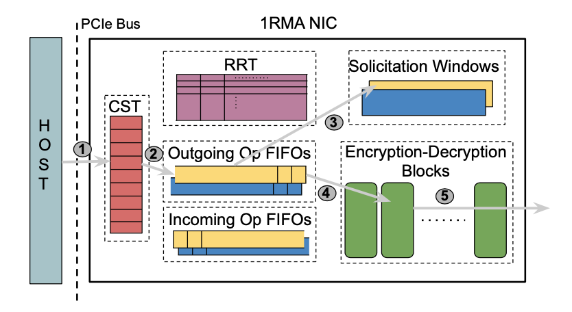
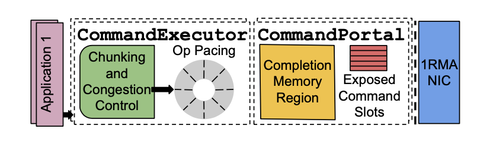
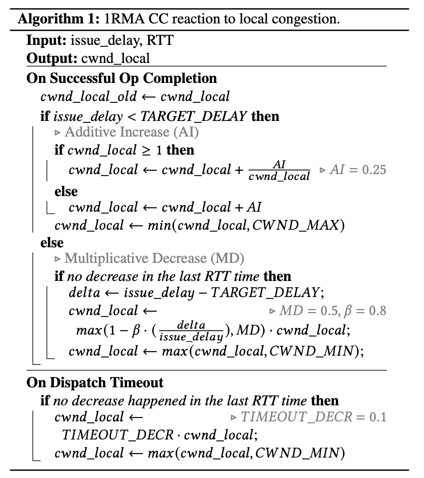
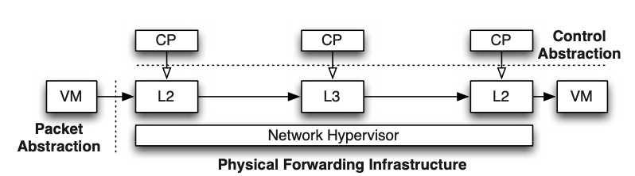
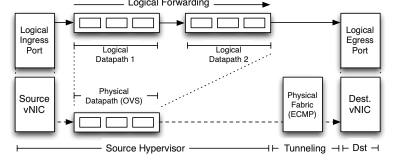
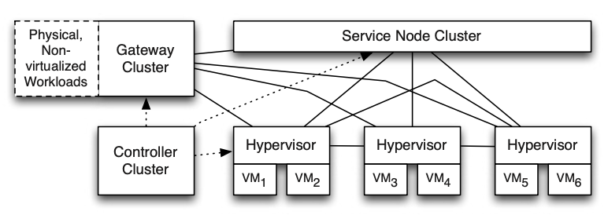
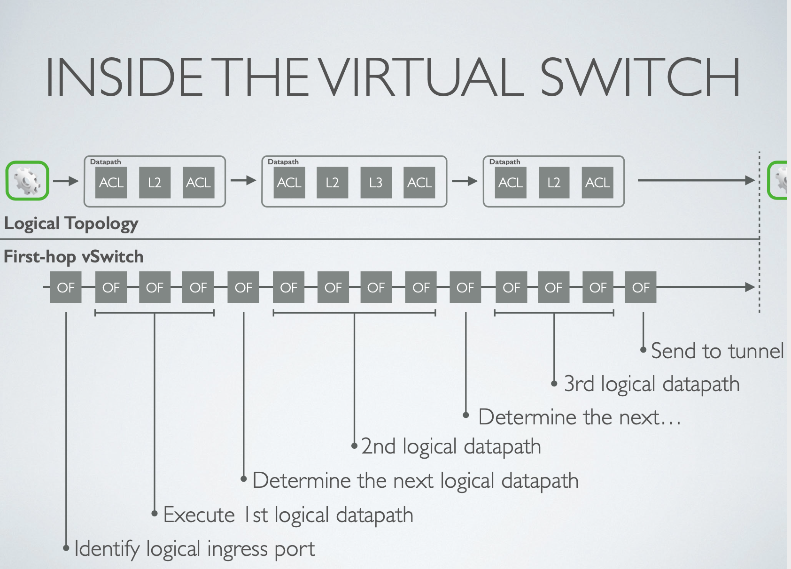
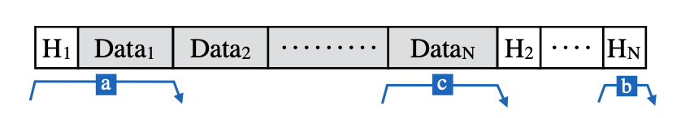

# Introduction
1. **One-Shot RMA (1RMA)** is a new approach to remote memory access for Multi-tenant Datacenters, It rooted in a principled division of labor between software and hardware. The 1RMA NIC is connection-free and fixed-function. It treats each RMA operation independently, assisting software by offering fine-grained delay measurements and fast failure notifications. 

2. **NVP** is a network virtualization platform designed for enterprise Multi-tenant Datacenters to support server virtualization.

3. **eRPC** is a new efficient general-purpose remote procedure call library that provides three key performance features: high message rate for small messages; high bandwidth for large messages; and scalability to a large number of nodes and CPU cores. Unlike other networking software, it achieves both high generality and high performance.

# Part 1 - 1RMA
## Motivation

Remote Direct Memory Access (RDMA) plays a key role in supporting performance-hungry datacenter applications, because of its low-latency, reliable, ordered networks and supercomputing fabrics deliver on these expectations via switch-enforced lossless link-level flow control. However, when RDMA is operationalized in multi-tenant datacenter, there are several issues:
* Connection-oriented design leading to poor scalability, ordering and failure semantics
* Unable to support complex key security management operation (rotating encryption keys)
* Unable to rapid iterate because of the choice of algorithm (congestion control) baked in hardware.

Therefore, a new approach need to be designed for multi-tenant datacenter to access remote memory.
## Approaches
### Important features:
* **Connection-free:**
	* 1RMA NIC acts on fixed sized operations and treat them independently. 
	* NIC tries operation completion within a fixed time. If it is successful, NIC provides detailed delay measures, otherwise NIC delivers precise operation failure notification.
	* 1RMA NIC leaves retry, ordering, congestion control and segmentation to software.

* **Solicitation:**
	* Each 1RMA operation transfers at most a 4KB payload, which enables isolation and prioritization. 
	* All data transfers are solicited: 1RMA does not initiate a transfer unless it is assured to land the data in on-NIC SRAM.
	* 1RMA relies on solicitation to limit the severity of sudden, transient incasts, because software congestion control cannot react instantaneously.

### 1RMA NIC hardware components:
* **Registered Region Table (RRT):** The RRT is 1RMA’s memory translation table. Which is maintained in fixed-size on-NIC SRAM. 
* **Command Slots and Command Slot Table (CST):** Each slot represents a single in-flight operation and can be reused once the operation completes. It consists of a fixed-number of slots in on-NIC SRAM, each of which is uniquely identified by its CommandSlotId.
* **SRAM Solicitation Window:** All data transfers in 1RMA are solicited. The solicitation window is allocated to inbound transfers and is the means to ensure that solicited data is not dropped. The solicitation window is sized proportional to bandwidth-delay product.
* **FIFO Arbiters:** FIFO arbiters are used to share the capacity in the solicitation window and each of them corresponds to an internal 1RMA class of service.

### 1RMA Software
* **CommandPortal** manages a collection of command slots and a memory region configured to accept completions, providing a familiar command/completion queue construct. 
* **CommandPortal** provides support for arbitrary-sized transfers, transparently chunked into up-to-4KB-sized operations and subject to software pacing for congestion control.

### Congestion Control
1RMA implements congestion control policies in software, assisted by NIC support for hardware measured delays and precise failure outcomes, delivered with each operation’s completion.1RMA provides fine-grained hardware delay measures in the form of issue delay and total delay. 
* Issue delay indicates how long it took for the operation to enter service
* total delay indicates how long it took to execute the operation. 

In case of every failed operation, the NIC tells exactly why it failed.1RMA uses these precise signals from hardware to implement condition control in software. It uses delay as a congestion signal as it simplifies congestion control design. 1RMA reacts separately to local and remote congestion: 
* a congestion window (CWND) for each <remote destination, direction> pair 
* a single local congestion window (CWND) for local congestion, because local congestion affects all local transfers

1RMA modulates congestion windows using a simple additive-increase- multiplicative-decrease controller loop based on whether the measure delay exceeds the target delay. It uses the more restrictive of the two CWNDs to set a limit on the number of outstanding operations in the network, and compute the operations’ issue rate as 𝑂𝑝𝑆𝑖𝑧𝑒×𝐶𝑊𝑁𝐷/RTT

### Security
* 1RMA transfers are encrypted and signed in hardware with line-rate AES-GCM(an authenticated encryption mode). It is designed in concert with 1RMA’s connection-free architecture. 
* 1RMA allows applications to directly manage encryption keys without requiring extending trust to infrastructure software, which makes frequent encryption key rotation with minimal availability disruption possible. 

### 1RMA Ops
* **Read:**  fetch data from memory of remote machines without involving the remote CPU.
* **Write:** write memory to remote machines. 1RMA implements write operations as a request-to-read: the writer asks a remote NIC to retrieve data via a read operation. 
* **Rekey:** provide first-class support for encryption key rotation. It enables control planes to manage pools of remote memory with no local CPU involvement.

# Part 2 - Network Virtualization in MTD(NVP)
## Motivation

In multi-tenant datacenters, tenants want to migrate unmodified workloads from their enterprise networks to service provider datacenters and retain the same networking configurations of their home network. The service providers needs to achieve this requirement without operator intervention. At the same time, they also need to preserve operational flexibility and efficiency. Although networking has long had a number of virtualization primitives, such as VLAN, VRFs, NAT, and MPLS, these are traditionally configured on a box-by-box basis, with no single unifying abstraction that can be invoked in a more global manner. Therefore, a network virtualization solution needs to be designed for multi-tenant datacenters. 

## Approaches
In a multi-center, each host in a datacenter has multiple virtual machines. Each physical host has a hypervisor.  Each hypervisor has an internal switch that accepts packets from local VMs and forwards them either to another local VM or over the physical network to another host hypervisor.  In order to implement this architecture, a network hypervisor is needed to exposes the right types of abstractions from tenants.

A network hypervisor essentially has two abstractions. 

* **Control abstraction.** It allows each tenant to define a set of logical network data-plane elements that they can control. This provides the tenants with illusion of complete ownership over the data-plane. 

* **Packet abstraction.** Whereby packets sent by these endpoints should see the same service, as they would in a native network with physical addresses, and physical data-plane elements. 

In the network virtualization platform, the network hypervisor implements these two abstractions by setting up tunnels between each pair of host hypervisors, which makes unicast possible. However, **multicast** and **broadcast** needs to be additionally implemented as overlay services on top of the pairwise tunnels. To perform packet processing, a centralized SDN controller configures the virtual switches on each virtual host. The logical datapath for flow of traffic is implemented entirely on the sending host.

### Controller cluster 
In controller of NVP, the host hypervisors and physical gateways provide the controller with location and topology information. Gateways connect the logical networks with workloads on non-virtualized servers. The service providers can configure the controller and the forwarding state is pushed to the Open vSwitch instances on each host.

Controller computation is scaled by decomposing the computation into two layers, logical controllers and physical controllers. 

* The **logical controllers** compute flows and tunnels for the logical datapaths. It encode all computed flow entries to create tunnels and queues for the logical datapath as universal flows. The universal flows are published over RPC to the bottom layer consisting of physical controllers. 
* The **physical controllers** communicate with the hypervisors, gateways, and service nodes.

This decomposition allows the logical controllers to operate on logical abstractions of the network without the knowledge of the physical topology or the parallel mesh between all of the hypervisors in the datacenter which reduces the computational complexity of the forwarding state computation (O(N) tunnels to remote transport nodes instead of O(N2)).

### Logical Datapath

NVP uses Open vSwitch (consists of a kernel module and a userspace program) in all transport nodes, including host hypervisors, service nodes, and gateway nodes to forward packets. The controller cluster uses two specific protocols to implement packet forwarding for logical datapaths, each of which consists of a series of logical flow tables with a globally-unique identifier. The tables consist of a set of flow entries that specify expressions to match against the header of a packet, and actions to take on the packet when a given expression is satisfied. 

In order to make the datapath fast, a user-space program allows matching on the full flow table. When a flow is matched in user space, a corresponding exact match table without any wildcard entries will be installed in the kernel. In this way, future packets for the same flow can be matched in the kernel, which makes the forwarding faster. Although exact-match kernel flows alleviate the challenges of flow classification on x86, NVP’s encapsulation of all traffic can result in significant overhead. To overcome this, NVP uses an encapsulation method called STT, which places a fake TCP header after the physical IP header, with the actual encapsulation header after that.

# Part 3 - eRPC
## Motivation
* It is believed that datacenter networking software options need to sacrifice generality to attain high performance. 
* Co-designing storage software with the network becomes increasingly popular, and is largely seen as necessary to achieve maximum performance. However, such specialization breaks abstraction boundaries between components, which prevents reuse of components and increases software complexity. This can be avoided with a general-purpose communication layer that also provides high performance. 

Therefore, a new general-purpose RPC system for datacenter networks needs to be designed.
## Approaches
### Scalability
* eRPC uses packet I/O over RDMA to avoid the circular buffer-scalability bottleneck in RDMA. By taking advantage of multipacket RX-queue descriptors in modern NICs, eRPC can use constant space in the NIC instead of a footprint that grows with the number of connected sessions. 
* eRPC replaces NIC-managed connection state with CPU-managed connection state, because NICs have limited SRAM to cache connection state, which limits scalability. The CPU miss penalty is much lower and CPUs have substantially larger cache compared with NIC.

### Zero-copy transmission
Zero-copy packet I/O in eRPC provides performance comparable to lower-level interfaces such as RDMA and DPDK. The msgbuf consists of per-packet headers and data, arranged in a fashion optimized for small single-packet messages. It ensures that the data region is contiguous, even when the buffer may contain data for multiple packets. The first packet's data and header are also contiguous so that the NIC can fetch small messages with one DMA read. Headers for remaining packets are at the end and the contiguous data region is in the middle.  

Since eRPC transfers packets directly from application-owned msgbufs, eRPC should ensure that it doesn't mess with msgbufs after ownership is returned to the application. eRPC addressed this problem by making sure that it retains no reference to the buffer. However, **retransmissions** can interfere with such a scheme. eRPC uses unsignaled packet transmission optimizing for the common case of no retransmission. But when there is retransmission, the process will be more expensive. 

eRPC also provides zero copy reception for workloads under the common case of single-packet requests and dispatch mode request handlers, which improves the message rate by up to 16 percent.

### Sessions and flow control
* Sessions support concurrent requests that can complete out of order with respect to each other, which avoids blocking dispatch-mode RPCs behind a long-running worker-mode RPC. 
* Sessions use an array of slots to track RCP metadata for outstanding requests, and slots have an MTU-size preallocated msgbuf for use by request handlers that issue short responses. 
* eRPC limits the number of unacknowledged packets on a session. 
* Session credits are used to implement packet-level flow control and it also supports end-to-end flow control to reduce switch queuing. Each session is given BDP/MTU credits, which ensures that each session can achieve line rate.

### Wire protocol 

A client-driven protocol is designed for eRPC that is optimized for small RPCs and accounts for per-session credit limits. The reasons are as follow:
* In a client-driven protocol, only the client maintains wire protocol state that is rolled back during retransmission, which means there is no client-server coordination before rollback. This reduce complexity.
* A client-driven protocol shifts the overhead of rate limiting entirely to clients, which free server CPU. 

eRPC applies Timely, a RTT-based approach, for congestion control to reduce switch queueing, thereby preventing packet drops and reducing RTT.  It also use three optimizations for its common-case workloads: **Timely bypass**, **rate limiter bypass** and **batched timestamps for RTT measurement**. To handle packet loss, for simplicity, eRPC treats reordered packets as losses by dropping them. 

# Trade-Offs

* eRPC uses client-driven protocol for simplicity. But as a result, the server cannot immediately send response packets after the first. Subsequent response packets are triggered by request-for-response packets that the client sends after receiving the first response packet, which will increase the latency of multi-packet responses.
* A connection-free design of 1RMA trade off the performance of a hardware-implemented connected transport for scalability and hardware simplicity.
* In NVP, exact match flow caching works well for typical workloads where the bulk of the traffic is due to long-lived connections, but when the short-lived connections dominate,   exact match flow caching might be insufficient.

# Open Questions and Future Work

Andromeda is Google Cloud Platform’s network virtualization stack. Both Andromeda and NVP are SDN-based network virtualization stacks, which is better?

